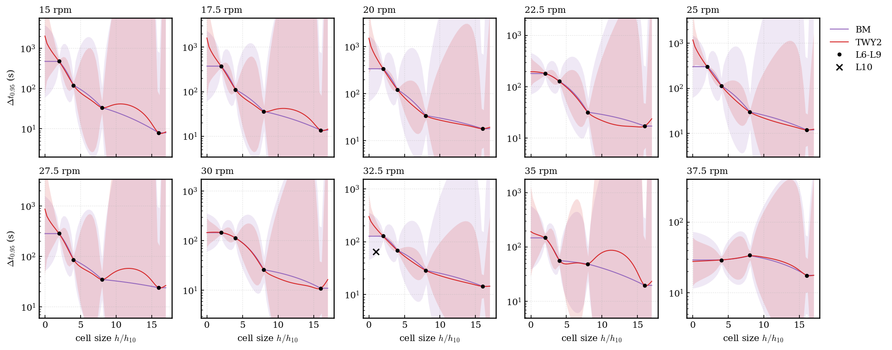
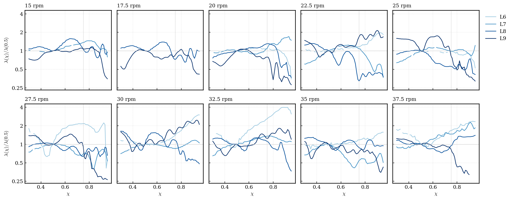

# Yi-h: grid-convergent multi-fidelity learning (problem definition, algorithm, assumptions)

Draft 8, 2026-10-03. This draft makes the method an extension of Yi et al. (2024), generic for engineering QoIs, with the bioreactor as a worked example only.

**History.** Drafts 2–6 went through 5 rounds of adversarial review. The reviewer approved draft 6 in round 5, and draft 7 closed its minor holes. Draft 8 rewrites the structure after the user's direction of 2026-10-03.

**Status labels:**
- **[lit]**: I read it in the cited paper.
- **[data]**: our measurement; the script is named.
- **[inference]**: my reasoning; it is not tested.
- **[assumption]**: a choice; it is not tested.

---

## 0. Summary

**The engineering problem.** A simulation code computes a quantity of interest (QoI) \(y(x, h)\) at inputs \(x\) and numerical resolution \(h\). Examples are mean or maximum wall shear, a mass-transfer coefficient, or a mixing time.
- Finer resolution costs much more (often \(2^{\gamma}\) per halving of \(h\), with \(\gamma\) from 2 to 5).
- The engineer wants the converged value \(f(x) = \lim_{h \to 0} E[y(x,h)]\) over a design region, with a stated uncertainty, inside a compute-time budget.
- Today, the standard practice is one of two:
  - a grid-convergence study at a few points (Eça & Hoekstra 2014), which is deterministic, per point, and needs at least 4 grids at each point;
  - a two-level multi-fidelity surrogate, which predicts the high-fidelity level, not the converged value.

**The method (Yi-h).** It keeps the three steps of Yi et al.'s KRR-LR-GPR: a deterministic regression of abundant cheap data, a linear transfer, and a Bayesian residual. It adds four things:
1. Any number of resolution levels in one likelihood. No level is the truth.
2. A covariance in \(h\) that encodes convergence (an E&H-type power law, \(h^p\), with \(p\) learned).
3. The target is \(h = 0\). The uncertainty of that extrapolation is part of the answer.
4. Cost-aware sequential design. It decides which inputs and which resolutions to run next, until the uncertainty is below a tolerance or the time budget is used.

Optional modules use special structure when a problem has it (Section 4). The bioreactor (Section 6) uses some of them.

---

## 1. Problem definition (generic)

**Given:**
- **Inputs:** \(x \in X \subset R^d\), with \(x = (u, v)\). Here \(u\) are the controls that a run sets (for example rpm and angle), and \(v\) are output coordinates that one run returns many of (for example a threshold χ). \(v\) can be empty.
  - \(\Sigma \subset X\) is the region of interest. \(\Sigma_N\) is a scrambled Sobol set of \(100 d\) points in \(\Sigma\), on which every "max over \(\Sigma\)" is computed.
  - All coordinates are scaled to [0, 1] over \(\Sigma\) inside the kernels.
- **Resolution:** a vector \(h = (h_1, ..., h_k) \in (0, \infty)^k\), with \(k \ge 1\). Examples: a cell size, a time step, the cell size of a scalar solved on its own grid.
  - Each component takes discrete values \(h_{j,\ell} = h_{j,0} 2^{-\ell}\). Finer values are always allowed; the budget is the only limit.
  - Inside the kernels, \(\bar h_j = h_j / h_{j,c}\), where \(h_{j,c}\) is the coarsest value used.
  - \(h = 0\) means the exact solution of the model equations.
- **Probe:** one run \(a = (u, h, T)\), with run length or other run setting \(T\). It returns a vector \(y_a\) at the coordinates \(O(a) \subset X\). In the generic case \(O(a) = \{u\}\).
- **Cost:** \(c(a) > 0\), in core-hours. It is unknown and is learned.
- **Budget** \(C\) (core-hours) and **tolerance** \(\varepsilon\) on the physical scale, relative (\(\varepsilon_{rel}\)) or absolute.

**Quantities to model and report** (the uncertainties are defined in Section 2.8):

| Symbol | Meaning | Decreases as \(h \to 0\)? |
|---|---|---|
| \(f(x)\), \(m_y(x)\) | the converged mean, and its posterior median | — |
| \(\sigma_{epi}(x)\) | epistemic: uncertainty about \(f(x)\); more runs reduce it | it decreases as data are added |
| \(s_0(x)\) | aleatoric: run-to-run spread at \(h = 0\) | no trend is imposed (Section 2.4) |
| \(\sigma_{fid}(x, h)\) | fidelity: the posterior RMS error of level \(h\) against \(f(x)\) | **yes**, to 0 (Fig. E, curve 2) |
| \(\sigma_{know}(x, h)\) | knowledge: the posterior sd of \(f(x, h)\) | **no**: it is small where data exist (Fig. E, curve 3) |

**Problem P1.** Find a sequential policy that chooses batches of probes \(a_1, ..., a_N\) and stops, so that

$$ \min \sum_i c(a_i) \quad \mathrm{s.t.} \quad \max_{x \in \Sigma_N} \sigma_{epi}(x \mid D_N) / \varepsilon(x) \le 1, \quad \sum_i c(a_i) \le C $$

and the calibration gates pass (Section 3). Here \(\varepsilon(x) = \varepsilon_{rel} m_y(x)\) or \(\varepsilon_{abs}\).

**Problem P2,** when P1 is infeasible within \(C\): minimise \(\max_{\Sigma_N} \sigma_{epi}/\varepsilon\) subject to \(\sum c \le C\). Report "not met", the value reached and where.

Notes:
- The constraint bounds \(\sigma_{epi}\), because compute can reduce only that part. \(s_0\) and \(\sigma_{tot} = (\sigma_{epi}^2 + s_0^2)^{1/2}\) are modelled and reported.
  - [lit] Design criteria use the de-noised variance for this reason: Binois et al. 1710.03206 eq 2.
- The bound is pointwise. It is not a simultaneous band.
- [lit] Stacking designs (Sung, Ji, Mak, Wang, Tang, 2211.00268 eq 6, 13) solves P1 for deterministic codes with known cost. Ehara & Guillas 2104.02037 Prop. 2 solves the budget form P2.

*Fig. E (synthetic, `scripts/plot_sigma_concepts.py`). Left: data at 4 levels and the posterior of \(f(h)\). Right, against \(h\):*
- *(1) the prior sd of the error of level \(h\);*
- *(2) the posterior RMS error of level \(h\), which is \(\sigma_{fid}\);*
- *(3) the posterior sd of \(f(h)\), which is \(\sigma_{know}\);*
- *(4) the sd of \(f(0)\) after one more probe at \(h\).*

*(1) and (2) go to 0 monotonically: "finer is closer to the truth". (4) decreases for finer probes: "finer is more informative". Only (3) is not monotone, because it describes what we know about each level, and we know most where we measured.*

---

## 2. Model: Yi-h

### 2.1 What Yi et al. do [lit, 2407.15110]

- Eq 1: \(f^h(x) = g(f^l(x), x) + r(x)\). The three parts are an LF model trained on LF data, a transfer model, and a residual model.
- Eq 2 is the linear special case \(f^l(x)\rho + r(x)\). Eq 4 allows a polynomial \(g\).
- The LF model is a deterministic KRR. The coefficients \(\rho\) come from GLS (Algorithm 1). \(r\) is a GP, with homoscedastic noise (App. A eq 7).
- The setting is "scarce, resource-intensive high-fidelity data with abundant but less accurate low-fidelity data" (abstract).
- There are two levels and no resolution variable. The target is \(f^h\).

### 2.2 The extension

For output \(k\) of probe \(a\):

$$ g(y_{a,k}) = \rho_0 + \rho_1 m_b(x_k) + r(x_k) + \delta(x_k, h_a) + e_{a,k} $$

| Term | Role | Relation to Yi |
|---|---|---|
| \(m_b(x)\) | **Backbone:** a KRR fit of abundant cheap data. That can be the coarsest level, or any cheap model (a reduced model, a correlation). | Yi's LF model, unchanged. The backbone data enter only through \(m_b\), as in Yi. They are not in the likelihood, so they are not used twice. |
| \(\rho_0 + \rho_1 m_b\) | linear transfer; the polynomial form of Yi eq 4 is allowed | Yi's LR step, now with a prior (Section 2.5) |
| \(r(x)\) | GP residual of the **converged** value | Yi's \(r\), moved to \(h = 0\) |
| \(\delta(x, h)\) | discretisation error of the levels above the backbone; \(\delta(x, 0) = 0\) | **new** |
| \(e_a\) | run-to-run noise vector, heteroscedastic, correlated inside a run | generalises Yi's homoscedastic noise |
| \(g\) | output transform (identity, log, reciprocal, ...) | new; chosen per QoI (Section 2.7) |

- **Target:** \(f(x) = g^{-1}(\rho_0 + \rho_1 m_b(x) + r(x))\), on the physical scale through Section 2.8.
- **Prior mean of the error** (the LR idea applied to the error amplitude):

$$ E[\delta(x, h)] = \sum_{j=1}^{k} \bar h_j^{p_j} (c_{0j} + c_{1j} m_b(x)) $$

  The error then can scale with the size of the QoI, as numerical diffusion often does.

**Yi is the special case [inference, by construction].** Fit data at one level \(h_1\) only, and take \(f(x, h_1)\) as the target. Then \(\delta(\cdot, h_1)\) is a GP in \(x\) with a mean that is linear in \(m_b\). It merges with \(\rho\) and \(r\):

$$ g(y)(x, h_1) = \rho_0' + \rho_1' m_b(x) + r'(x) + e $$

This is Yi eq 2–4 with a linear \(g\), a GP residual and Gaussian noise. With two or more levels and the target at \(h = 0\), the model is new.

**Why keep Yi's backbone** [inference]:
- It is the scalability lever. Cheap data carry the \(x\)-shape, so the expensive levels only need to resolve \(r\) and \(\delta\).
- If the backbone is not informative, the posterior of \(\rho_1\) goes to 0. The model then becomes a plain multi-level GP, so it fails gracefully.
- The posterior of \(\rho_1\) is reported.

### 2.3 Convergence covariance in \(h\)

$$ \delta - E[\delta] \sim GP(0, \; \sigma_\delta^2 k_x(x, x') k_h(h, h')) $$

Two families are candidates, and Section 2.7 weights them.

- **TWY2 (Richardson type):** \(k_h = \prod_j (\bar h_j \bar h_j')^{p_j} c_\nu(\bar h_j - \bar h_j'; \ell_{h,j})\), with \(c_\nu\) a Matérn correlation.
  - [lit] Bect et al. 2103.14559 Prop. 3 (one component): \(\delta(h) = A h^p + o(h^p)\) almost surely. This is the E&H power law, with the amplitude a GP in \(x\).
  - [lit] It has the same structure as PRE 2401.07562 eq 10.
  - [lit] Bect §4.3: TWY2 intervals were "simultaneously smaller than the GCI interval and with a good coverage".
- **LB (lifted Brownian):** [lit] Boutelet & Sung 2503.23158 eq 4, with \(\gamma \in (0,1)\) controlling "the correlation between increments".
  - The Brownian kernel of Tuo–Wu–Yu, \(\min(h,h')^{2p}\), is \(\gamma = 0.5\).
  - [lit] Bect Prop. 2: in that case the Richardson form "does not hold".
  - [lit] Boutelet Fig. 1: increments are positive for an average-type QoI, and "somewhat uncorrelated or negatively correlated" for a maximum-type QoI.
- **Several resolution components:**
  - The product over \(j\) is [inference].
  - [lit] CONFIG 2209.13748 eq 19 gives a kernel for several fidelity parameters (a sum inside a power). It is an alternative.
- **Properties:**
  - The prior variance of the error is \(\sigma_\delta^2 k_x(x,x) \prod_j \bar h_j^{2p_j}\). It goes to 0 and is monotone.
  - The order \(p_j\) is learned (Section 2.5). One \(p_j\) is shared over \(X\) (assumption A3).

### 2.4 Noise

$$ e_a \sim N(0, S_a), \quad S_a = D_a R_a D_a $$

- Runs are independent. Inside a run, \(R_a\) correlates the outputs.
  - [lit] Matrix-normal emulators count one run as one correlated vector: Overstall & Woods 1506.04489 eq 2. We keep \(R\) separate from the signal correlation.
- \(D_a\) is the diagonal of the noise sd: \(\log s^2(x, h) = m_s + \sum_j b_{s,j} \bar h_j + \zeta(x, h)\), with \(\zeta\) a latent GP.
  - [lit] hetGP 1611.05902 eq 14 smooths latent log-variances, so it works with few replicates.
- The trends \(b_{s,j}\) have symmetric priors, so the spread may grow or shrink as \(h \to 0\).
  - [lit] Analogous evidence: in an LES study the Lyapunov growth rate increases on finer meshes (1801.03046 §4.2).
- A replicate is a run with a small perturbation (for example a shifted start of the measurement). Whether that spread equals the physical spread is assumption A7.

### 2.5 Priors (all proper) and inference

| Parameter | Prior | Source |
|---|---|---|
| \(\rho\), \(c\) | flat if no link and the basis matrix has full column rank; else Gaussian, centred on a physical estimate | improper posterior otherwise [inference] |
| \(p_j\) | \(\log p_j \sim N(0, 1)\) | wide; covers E&H's range |
| Matérn variance and range (\(r\), \(\delta\), \(\zeta\), \(R\)) | PC prior: \(P(\ell < 0.1) = 0.05\), \(P(\sigma > S) = 0.05\) | [lit] Fuglstad et al. 1503.00256 Thm 2.6. Their range parameter equals \(2\ell\) in our Matérn form. Use per ARD dimension: [inference] |
| \(\gamma\) (LB) | Uniform(0, 1) | |
| \(m_s\), \(b_{s,j}\) | Gaussian; \(b_{s,j}\) symmetric, with sd \(\log 4\) | [assumption] |

- The scales \(S\) are problem-specific, and they are the only problem-specific part (R7).
- A **known admissible range** (for example a positive rate) goes into the prior through a link, \(\rho_0 + \rho_1 m_b + r = \psi(\tilde\mu)\). It does not go into a gate.
- **Sampling:** Gibbs.
  - Latent Gaussian fields use elliptical slice sampling. [lit] Murray, Adams & MacKay 1001.0175: it "has no free parameters".
  - Their hyperparameters use the surrogate-data slice sampler. [lit] Murray & Adams 1006.0868: it "requires little tuning while mixing well in both strong- and weak-data regimes".
  - Censored values use data augmentation.
- **Convergence rule:** 4 chains; rank-normalised split-\(\hat R < 1.01\) and ESS > 400 for every reported quantity. [lit] Vehtari et al. 1903.08008 §1 and §4.
- Why sample at all: [lit] ML-II "underestimate[s] prediction uncertainty" (1912.13440 §1).

### 2.6 Cost model

$$ \log_2 \kappa(u, h) = \kappa_0 + \sum_j \gamma_j \ell_j + \omega(u, h) + \eta $$

- \(\kappa\) is the cost per unit of run length, and \(c(a) = \kappa (T_{fixed} + T_{obs}) + c_0\).
- \(\omega\) is a GP. So the posterior can depart from the power law \(2^{\gamma \ell}\), which is only the prior mean. \(\gamma_j \sim N(3, 1)\) [assumption: 2D explicit time stepping, 4× cells and about 2× steps per level].
- [lit] Snoek 1206.2944 §3.2 puts a GP on log cost. Guinet 2011.11456 reports that simple cost models often predict better, so the prior mean carries most of the weight when data are few.
- **When the output is a time** (the run length needed is the unknown output): [lit] Hutter 1310.1947 Def. 1. The expected observed time is \(E[T_{obs}] = \int_0^T P_n(\tau > t) dt\).

### 2.7 Several candidate structures

- A structure is \(M = (k_h\) family, \(g\), set of levels used\()\).
- **Weights by stacking on an extrapolation score.**
  - Fit every \(M\) without the finest level, and score the held-out finest-level runs. This tests extrapolation in \(h\).
  - [lit] Yao, Vehtari, Simpson & Gelman 1704.02030 eq 2.2 (log score). They recommend stacking because BMA "is flawed in the M-open setting".
  - A Dirichlet(2, ..., 2) penalty regularises the weights. [lit] Their §4.1 suggests "a strong prior … to the weights".
- **Cross-fitting:** the weights come from half of the held-out sites, and the calibration (Gate G1) from the other half; then swap.
- With only 2 levels left, \(p\) is not identifiable there. Then the weights stay equal and are flagged.

### 2.8 Prediction on the physical scale

- Pool the posterior draws over the structures with their weights, and back-transform them with \(g^{-1}\).
- \(m_y\) is the median. \(\sigma_y = (q_{84} - q_{16})/2\).
- Quantiles exist for every transform. For example, if a rate is Gaussian, the time \(1/\)rate has no finite moments.
- The Gaussian of the requirement is \(N(m_y, \sigma_y^2)\). Gate G6 checks its shape.
- \(\sigma_{epi}\) is \(\sigma_y\) of \(f(x)\).
- \(\sigma_{fid}(x,h) = (E[(f(x,h) - f(x))^2 \mid D])^{1/2}\), computed from the same draws.
- \(\sigma_{tot}\) is the spread of draws of \(g^{-1}\)(target + noise).

---

## 3. Algorithm

**Step 0, set the problem.** Choose \(\Sigma\), \(\varepsilon\), \(C\) and the batch size \(q\). Choose the candidate transforms, the backbone source, the prior scales, and the optional modules of Section 4.

**Step 1, initial design.**
- **Backbone:** a space-filling design of the cheapest source, as large as is cheap. This is Yi's abundant LF.
- **Ladder:** nested Sobol designs in \(u\) at the levels above it. [lit] Stacking designs eq 9 gives starting sizes.
- **Replicates:** at 3 or more levels at 3 or more sites.
- This minimum is necessary, not sufficient [inference].

**Step 2, fit.** Run MCMC for every candidate \(M\) (Section 2.5), then compute the stacking weights (Section 2.7).

**Step 3, gates (diagnostics and calibration).**

| Gate | Test | Pass rule |
|---|---|---|
| G0 order | posterior of \(p_j\); observed increment ratios | \(P(p_j > 0.5) \ge 0.9\). **A failure does not stop the method.** It means the limit is not yet identified, so \(\sigma_{epi}\) is large, and Step 5 then prefers finer levels. [lit] E&H treat \(p < 0.5\) as anomalous. |
| G1 level hold-out | cross-fitted prediction of the finest level | 95% coverage within binomial limits; no sign bias; \(C_{LOO}\) near 1 [lit: Bachoc 1301.4320 eq 6; Oliver 1311.0828 eq 17] |
| G2 block LOO | leave out whole runs | z ~ N(0, 1); U statistic [lit: Overstall & Woods eq 10] |
| G3 noise | replicate spread against \(s^2\) | chi-square, p > 0.05 |
| G4 pre-asymptotic | refit without the coarsest level | the target moves less than \(\sigma_{epi}\); else remove that level |
| G5 structure | monotone coordinates stay monotone | no violation on \(\Sigma_N\) |
| G6 shape | 2.5/97.5% quantiles against \(m_y \pm 1.96\sigma_y\) | difference < 10% of \(\sigma_y\) |
| G7 prior | halve and double each prior scale (importance reweighting; refit if ESS < 400) | \(m_y\) moves < \(0.5\sigma_{epi}\) and \(\sigma_{epi}\) changes < 20%; else the output is flagged "prior-dominated" |

- **Repair:** at most 2 cycles per gate: remove a pre-asymptotic level (G4), recompute the weights, or buy a finer probe where \(|z|\) is largest.
- If a gate still fails, the output is labelled "uncalibrated". It is never silently reported as calibrated.
- The thresholds are [assumption].

**Step 4, stop or forecast.**
- **Success:** P1 holds and the gates pass.
- **Budget used:** report P2.
- **Forecast:**
  - Simulate the greedy policy of Step 5 on fantasy data, with 20 fixed posterior samples, until success. This gives a distribution of the cost to success.
  - If the probability of exceeding \(C\) is above 0.5, tell the user the forecast. This is a report, not a stop: the method continues and minimises \(\max \sigma_{epi}/\varepsilon\) (P2) with the rest of the budget.

**Step 5, acquisition: maximum uncertainty reduction per cost.**

$$ a^\star = \arg\max_{a \in A} \; (H_n - E J_n(a)) / E c(a), \qquad H_n = \sum_{x \in \Sigma_N} (\sigma_{epi}^2(x)/\varepsilon^2(x) - 1)_+ $$

- [lit] The ratio is MR-SUR (Stroh et al. 2007.13553 eq 11). The hinge form of \(H_n\) is our change [inference]. It is zero exactly when P1 holds.
- **Candidates:** every \(u\) in a candidate set, **at every resolution, including resolutions finer than any run so far**, and every optional action of Section 4.
  - The cost model prices each candidate, and the acquisition chooses. So refinement happens when it is the best use of the budget (Fig. E, curve 4).
- \(J_n(a)\) is a Monte Carlo average over 16–256 fantasies. Each fantasy:
  - draws the hyperparameters and the latent noise;
  - draws the outputs, including which nested outputs are reached and which are censored;
  - reweights the posterior samples and recomputes \(H\).
  - [lit] Snoek 1206.2944 §3.3 uses Monte Carlo over pending outcomes.
  - The number of fantasies is doubled until the Monte Carlo error is below 10% of the gap between the two best candidates.
- **Batches:** choose greedily, and condition on the pending runs. [lit] Takeno 1901.08275 eq 7–8; Kathuria 1611.04088.

**Step 6, run the batch, add the data, and go to Step 2.**

**Computational cost** [inference, order of magnitude]: for 400 data, about 120 candidates and 16 fantasies, the acquisition costs about \(10^{12}\) flops, which is minutes to an hour on one node. MCMC time must be measured.

**Output:** for each \(x \in \Sigma\): \(m_y\), \(\sigma_{epi}\), \(s_0\) (or "not identified"), and \(\sigma_{tot}\); \(\sigma_{fid}(x, h)\) for the levels used; the posteriors of \(p_j\) and \(\rho_1\); the stacking weights; the gate table; the spent cost and the allocation per level.

---

## 4. Optional modules: assumptions that use the structure of a problem

Each module is generic. The core (Sections 1–3) works without any of them. A module states an assumption, how it changes the algorithm, and how to check it.

| # | Structure | Assumption | Change to the algorithm | Check | Bioreactor |
|---|---|---|---|---|---|
| S1 | Nested outputs | One run returns the QoI at all values of an output coordinate up to a stopping value (a time-to-threshold curve, a load-displacement curve). | \(O(a)\) depends on the outputs; \(R\) correlates them; outputs not reached by \(T\) are censored. [lit] taKG 1903.04703 §2.3: shorter outputs come free. | G2 on whole runs | \(\Delta t_{mix}(\chi)\) for all χ ≤ the χ reached |
| S2 | Pause and resume | A run can continue from a checkpoint. | Action extend(\(j\), \(T \to T'\)) at incremental cost. [lit] Freeze-thaw 1406.3896; taKG §2.6. | restart parity test | chain/checkpoint tools exist |
| S3 | Warm start across levels | A finer run can start from a coarser state and lose less spin-up time. | Lower \(T_{fixed}\) for that action. | the result must not depend on the start (test A11) | the L10 runs were warm-started; test pending |
| S4 | Several resolution components | Parts of the model can be resolved separately. | \(h\) is a vector (Section 2.3); each part has its own order \(p_j\). | G0 per component | flow grid and scalar grid: a passive tracer on a finer grid, advected by a stored, converged, periodic flow |
| S5 | Several QoIs per run | One run gives many QoIs. | The criterion sums over QoIs, with weights \(1/\varepsilon_q^2\). [lit] Giles 1304.5472 §7.4. | — | kLa, \(\Delta t_{mix}\) and shear from one run |
| S6 | Known admissible range | The converged value must be in a known range. | a link in the prior (Section 2.5) | G7 | rates > 0 |
| S7 | Monotone coordinate | \(f\) is monotone in one coordinate. | Gate G5; enforce only if it is violated. [lit] López-Lopera 1901.04827 eq 8. | G5 | \(\Delta t_{mix}\) increases with χ |
| S8 | Dense cheap source | A cheap model gives abundant data with the right trends. | It is the backbone \(m_b\) (Yi's regime). | the posterior of \(\rho_1\) is away from 0 | L6 (0.015 core-h per run) |

---

## 5. Core assumptions

| # | Assumption | Status | Test |
|---|---|---|---|
| A1 | \(g(y)\) is Gaussian | untested | G6; Q–Q plots of G2 |
| A2 | The code converges, \(\delta(x, 0) = 0\) | fundamental; the data can show convergence only within the levels run | G0 |
| A3 | Leading power law, one \(p_j\) over \(X\) | [lit] Bect Prop. 3 | G0; let \(p\) vary with \(x\) |
| A4 | The \(k_h\) family | stacking weights | G1 |
| A5 | Separable \(k_x k_h\) | untested | G2 residuals against \(x\) |
| A6 | Noise trend in \(h\) of either sign | [lit] analogy only | replicates |
| A7 | A perturbed replicate represents the physical spread | untested | experimental replicates |
| A8 | Stationary kernels in \(x\) | untested | G2 |
| A9 | The backbone is informative | posterior of \(\rho_1\) | reported |
| A10 | The coarsest ladder level is in the asymptotic range | per problem | G4 |
| A11 | (with S3) The warm start does not change the QoI | per problem | a direct comparison |
| A12 | Fantasy reweighting values the probes that reduce the uncertainty of \(p\) | [inference] | synthetic test |
| A13 | Stacking weights for one-level extrapolation transfer to \(h = 0\) | untestable without a finer level | a finer level |

---

## 6. Worked example: mixing time in a 2D rocking bioreactor

**Setting.**
- \(\Delta t_{mix}((\chi, \theta_{max}, rpm), h)\), with \(\chi \in [0.5, 0.95]\), \(\theta_{max} \in [2, 9]\)°, and rpm \(\in [15, 37.5]\).
- \(u = (\theta_{max}, rpm)\) and \(v = \chi\) (module S1).
- \(\varepsilon_{rel} = 0.10\).
- Budget: one week of the `priority` QOS, which is 312 cores, so \(C \le 52{,}000\) core-h.
- The physical system is taken to be 2D.

**Evidence so far:**

| # | Finding | Evidence |
|---|---|---|
| F1 | L6–L9 do not show convergence of \(\Delta t\). The increment ratio R must be about \(2^p > 1\) for convergence. Measured R: 0.2–0.4 for \(\Delta t\); 0.6–1.2 for \(\log \Delta t\); 1.5–3.4 for \(1/\Delta t\), but the Richardson limit of the rate is negative at 9 of 22 triplets. The limit is therefore not yet identified. | [data] Fig. D, `scripts/diag_observed_order.py` |
| F2 | kLa (no transform) converges plausibly: monotone at 90–100% of rpm on L6–L8 and 56–60% on L7–L9. | [data] `observed_order_kla.png` |
| F3 | No fixed kink in χ(t): the late/early decay-rate ratio is 0.36–3.65, and its direction changes with rpm and with level. | [data] Fig. A |
| F4 | Cost per level: ×7, ×9, ×21 per simulated second. Per probe to \(\Delta t_{0.95}\): ~0.015, 0.25, 6 and 300 core-h at L6–L9. The 80-cycle spin-up is 40–55% of an L9 run. | [data] Fig. C |
| F5 | L6 loses 7–10% of the tracer mass (L9: under 0.4%). | [data] diary 2026-10-03 |
| F6 | Held-out L9 from L6–L8: in log space all z-scores are positive (systematic). The kernel choice changes \(f(0)\) by 2–4×. | [data] Fig. B |
| F7 | Kim's manuscript says uniform \(n_L = 2^{10}\) (Main.tex:432). The shared code sets MAXLEVEL = 9 with a static band refinement, and was never changed in our history. Kim's 120 core-h is ~30× below our L10 cost. The evidence points to L9. | git `ea66816`, `tests/fixtures/kim_upstream/BioReactor.c:180` |

*Fig. D. Increment ratio R per rpm, for L6–L8 (circles) and L7–L9 (squares). Rows: \(\Delta t\), \(\log \Delta t\), \(1/\Delta t\). Dashed: R = 1, no convergence. Dotted: R = 2.8, order 1.5.*

*Fig. B. \(\Delta t_{0.95}\) against cell size, per rpm: TWY2 and Brownian posteriors on L6–L9, with 95% bands. The cross is the single L10 run.*

*Fig. C. Measured cost. Left: core-s per simulated second. Right: core-h to observe \(\Delta t_{0.95}\) after release.*

*Fig. A. The period-averaged decay rate \(\lambda(\chi)/\lambda(0.5)\) for L6–L9.*

**What the method will do with this** [inference]:
- G0 fails today, so \(\sigma_{epi}\) at \(h = 0\) is large.
- The acquisition will then value L10 probes, which are the only way to identify the limit.
- An L10 probe to \(\Delta t_{0.95}\) costs about 3,600 core-h at 32.5 rpm (spin-up included) and much more at low rpm. So within 52,000 core-h the method can buy roughly 5–14 of them, mostly at high rpm.
- [inference] With a Péclet number of about \(10^7\) (\(D = 0.44 \times 10^{-9}\) m²/s, `src/BioReactor.c:201`), the Batchelor scale is about 50 µm, against 0.49 mm at L9. If the asymptotic range starts only near that scale (L12–L13), the method will end in P2 with an honest, large \(\sigma_{epi}\). If L10 already shows convergence, it can succeed.
- Module S4 (a scalar grid finer than the flow grid on a stored converged periodic flow) could make the fine scalar levels much cheaper. It fits the general framework as a second resolution component. It needs a replay solver, which is in BACKLOG and is untested.

**Runs in progress** (25 jobs, submitted 2026-10-03, same binaries and protocol as the ladder):
- **Replicates:** tracer release at cycles 82 and 85 (and 80 at L7), at L6–L8 × 17.5/25/32.5 rpm and L9 × 25 rpm. They give \(s(x,h)\), its trend in \(h\), and \(R\).
- **Spin-up test** (A11): L8 at 32.5 rpm, release after 33 and 50 cycles instead of 80. The only L10 data point was released after 33 cycles. This test tells whether that point is usable and whether warm starts (S3) are allowed.

---

## 7. Open questions

- **Q-a.** Prior scales: some were chosen after seeing L6–L9, which uses the data twice; G7 tests their influence. Can you give physical values?
- **Q-b.** Should module S4 (two resolution components with a replayed flow) be developed now, or after L10 probes show whether the scalar converges?
