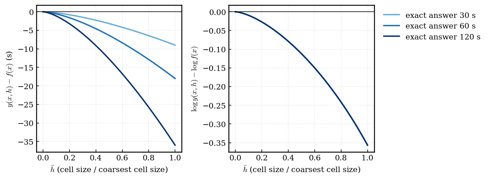
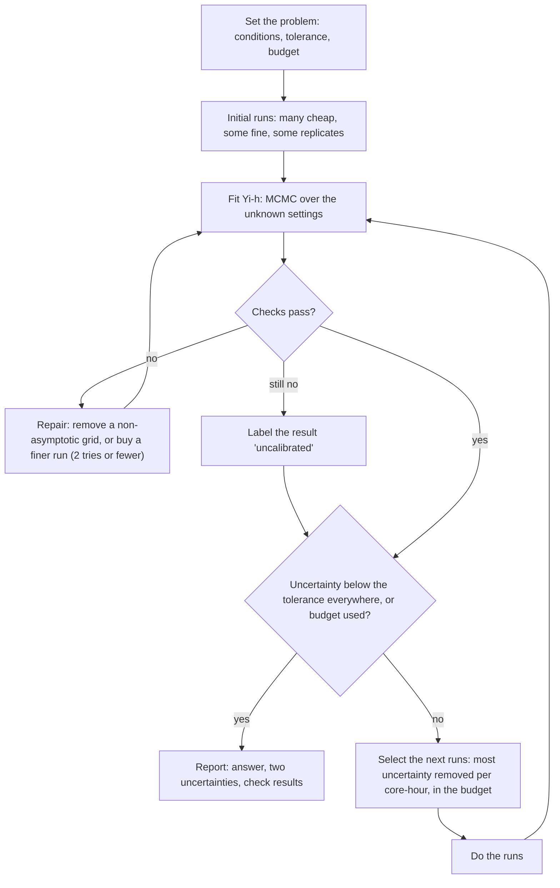

# Yi-h: a guide

This guide explains the method in steps. Each step has a figure and a small example. You must know calculus, basic statistics, least squares, and what a CFD grid is. The precise specification is at the end of the page, in a closed section. Click it to open it.

Figures T1–T5 are toy problems. A toy problem has a known answer. Figures C–F use our bioreactor data. Section 8 explains the checks G0–G7 ("gates").

---

## 1. The problem

We simulate a rocking bioreactor. A bioreactor is a bag that is half full of liquid. A machine rocks the bag. One **cycle** is one rocking period. We want **quantities of interest (QoIs)**. Examples:
- \(\tau_{95}\): the 95th percentile of the shear stress on the bag wall. This QoI is purely hydrodynamic.
- \(k_La\): the speed at which oxygen goes into the liquid.
- the **mixing time** \(\Delta t_\chi\): the time that a dye needs to mix to the level \(\chi\). For example, \(\chi = 0.95\) means that 95% of the initial non-uniformity is gone.

We want each QoI at every operating condition \(x\). An example of a condition is the rocking speed (rpm) and the rocking angle.

The code has one setting for accuracy: the **cell size** \(h\) of the grid. Each grid level (L6, L7, L8, ...) has half the cell size of the level before it.
- A **coarse grid** is cheap, and its result has a large error.
- A **fine grid** is expensive, and its result has a smaller error.
- **No grid is exact.** The exact answer of the model equations is the limit \(h \to 0\). No run can get to this limit.

*Fig. T1 (toy). One QoI on four grids, L6 (coarsest) to L9 (finest), and the exact curve. Each refinement moves the curve nearer to the exact curve. Each step is smaller than the step before it.*

The task has three parts:
1. **Get the exact answer from several approximate answers,** at one condition. This is grid convergence (Section 2).
2. **Get all conditions from a small number of conditions.** This is regression. We use Gaussian processes (Section 3).
3. **Select the next run.** A run on the next finer grid costs 17 to 50 times more, and the compute budget is fixed (Section 7).

The output is a number with an honest error bar at every condition. An example: "at 25 rpm and 7°, \(\tau_{95}\) is 0.012 Pa ± 5%". The ± includes all that we do not know.

---

## 2. Step 1: grid convergence

**Why the error decreases as \(h^p\).** A numerical scheme replaces derivatives with differences. A Taylor expansion shows the error of a scheme of order \(p\). When \(h\) is small, this error is \(C h^p\) plus smaller terms. A QoI that the grid calculates has the same type of error:

$$ f(h) \approx f(0) + a \, h^p $$

\(f(0)\) is the exact value. \(a\) and \(p\) are unknown (Bect et al. 2021, arXiv 2103.14559, eq 1). When this approximation is correct, the grids are in the **asymptotic range**.

**How to find \(p\) and \(f(0)\).** Compare two grids. The cell size of one grid is half the cell size of the other grid:

$$ f(h) - f(h/2) = a h^p (1 - 2^{-p}) $$

Thus each difference between two neighbour grids is \(2^p\) times the next difference. We call this ratio \(R\). There are three unknowns (\(f(0)\), \(a\), \(p\)), so you need three grids. A fourth grid checks the result: in the asymptotic range, the two ratios are equal.

**Example (Fig. T2).**
- Four grids with \(h = 1, 1/2, 1/4, 1/8\) give 2.2620, 1.7536, 1.5738, 1.5103.
- The differences are 0.5084, 0.1798 and 0.0635.
- The ratios are \(0.5084/0.1798 = 2.828\) and \(0.1798/0.0635 = 2.832\). The two ratios are equal, so the grids are in the asymptotic range. \(R = 2.83 = 2^{1.5}\) gives \(p = 1.5\).
- The remaining distance to \(h = 0\) is a geometric series of smaller and smaller differences. Its sum is \(0.0635/(2^{1.5} - 1)\). Thus \(f(0) = 1.5103 - 0.0635/1.828 = 1.4756\).
- The exact value is 1.4755. The difference comes only from rounding.

This method is **Richardson extrapolation** (Bect et al. 2021, §2.1, eqs 2–3, give \(\hat p\), \(\hat A\) and \(\hat f_0\) from three grids).

*Fig. T2 (toy). Four grids at one condition, the power-law fit, and the extrapolated limit (star).*

**Problems with real data:**
- **Noise:** repeated runs give different results. Thus the differences are not certain.
- **Not yet asymptotic:** the two ratios are not equal.
- **Oscillation:** the differences change sign (\(R < 0\)).

**Eça & Hoekstra (2014)** give a careful procedure for one QoI at one condition:
- Fit the power law by least squares to 4 or more grids.
- Select the **error model** from the observed \(p\). The error model is the form of \(f(h)\) that you fit: a free \(p\), a fixed \(p = 1\) or 2, or two terms.
- Report the uncertainty \(U = F_s \lvert \varepsilon \rvert\). \(\varepsilon\) is the estimated error of the finest grid. \(F_s\) is the **safety factor**: 1.25 when the data are regular, and 3 when they are not. These two values come from Roache's Grid Convergence Index (GCI) (Bect et al., §2.1, eqs 4–6).

---

## 3. Step 2: a Gaussian process

**The idea.** A Gaussian process (GP) is a probability distribution over functions. You do not select one curve. You state which curves are probable. Then the data remove some curves. The standard reference is Rasmussen & Williams (2006), *Gaussian Processes for Machine Learning*, Ch. 2.

**Definition.** \(f\) is a GP if this condition is true: for each finite set of inputs \(x_1, ..., x_n\), the values \(f(x_1), ..., f(x_n)\) have a joint Gaussian distribution. Their mean is \(m_0\) (here, a constant). A **kernel** \(k(x_i, x_j)\) gives their covariances.

**An example kernel** (the kernel of Fig. T3):

$$ k(x, x') = 0.6^2 \exp(-(x - x')^2 / (2 \cdot 0.2^2)) $$

- **0.6 is the amplitude.** It is the usual size of the differences from \(m_0\).
- **0.2 is the length scale.** Two inputs that are nearer than approximately 0.2 have similar values. Two inputs that are much farther apart are almost independent.

**Prior, likelihood, posterior.**
- The **prior** is the GP before the data (Fig. T3, left).
- The **likelihood** gives the relation between the observations and \(f\): \(y_i = f(x_i) + \) noise. The noise has the standard deviation \(s\).
- **Bayes' rule** combines the prior and the likelihood. The result is the **posterior**: the GP after the data (Fig. T3, right).

*Fig. T3 (toy). Left: four curves from the prior, and the 95% band (mean ± 1.96 sd), before data. Right: curves from the posterior, after five observations. The band is narrow near the observations. The band is wide between them.*

**The source of the formulas: one observation.** Take one observation \(y_1\) at \(x_1\). The values \(f(x)\) and \(y_1\) have a joint Gaussian distribution. Let \(A\) and \(B\) be two values with a joint Gaussian distribution. When you know that \(B = b\), the mean and the variance of \(A\) change to:

$$ E[A \mid b] = E[A] + (b - E[B]) \, Cov(A, B) / Var(B), \qquad Var(A \mid b) = Var(A) - Cov(A, B)^2 / Var(B) $$

Here \(A = f(x)\) and \(B = y_1\). \(Cov(f(x), y_1) = k(x, x_1)\) and \(Var(y_1) = k(x_1, x_1) + s^2\). Thus:

$$ m(x) = m_0 + k(x, x_1) (y_1 - m_0) / (k(x_1, x_1) + s^2) $$

- When \(x\) is near \(x_1\), \(k(x, x_1)\) is large. The prediction moves toward \(y_1\).
- When \(x\) is far from \(x_1\), \(k(x, x_1) \approx 0\). The prediction stays at \(m_0\), and the band keeps its prior width.

**With \(n\) observations,** the same rule gives a matrix equation. \(K\) is the matrix of \(k(x_i, x_j)\). \(k_*\) is the vector of \(k(x, x_i)\):

$$ m(x) = m_0 + k_*^T (K + s^2 I)^{-1} (y - m_0) $$

The posterior variance is \(k(x,x) - k_*^T (K + s^2 I)^{-1} k_*\). The 95% band is \(m(x) \pm 1.96\) sd.

Three facts are more important than the formulas:
1. The prediction is a weighted sum of the observations. Near observations get larger weights.
2. The uncertainty is small near the data. It is large far from the data.
3. The kernel settings (amplitude, length scale) are also unknown. We get them from the data (Section 6).

**A kernel along the grid axis.** We can make \(h\) one more input. The QoI is the exact value plus an error:

$$ f(x, h) = f(x, 0) + \mathrm{error}(x, h) $$

We put a GP on the **error term**. Its kernel in \(h\) is proportional to \((h h')^p\). Thus its variance at one \(h\) is \(k(h, h) \propto h^{2p}\). The standard deviation of the error decreases as \(h^p\), and it is exactly zero at \(h = 0\). This puts Richardson extrapolation into the GP. The GP then predicts \(f(x, 0)\) and gives its uncertainty. Tuo, Wu & Yu (2014) had this idea. Bect et al. (2103.14559, §2.2, eq 7) give it again. The probabilistic Richardson extrapolation of Oates et al. (arXiv 2401.07562, §2) develops it more.

---

## 4. Step 3: multi-fidelity learning (Yi et al. 2024)

**The idea.** There are many cheap runs and a small number of expensive runs. The cheap and the expensive results usually change together. Then the cheap runs give the shape of the function, and the expensive runs correct it. The classical form is "expensive = \(\rho \times\) cheap + correction" (co-kriging, Kennedy & O'Hagan 2000, Biometrika 87:1–13).

**Yi et al.'s KRR-LR-GPR** has three steps:
1. Fit the cheap data with **kernel ridge regression (KRR)**. KRR is the GP posterior mean of Section 3 without the variance. It is a fast fit, and it has no uncertainty.
2. Apply a **linear transfer** (LR): \(\rho_0 + \rho_1 \times\) (cheap fit).
3. Fit a **GP to the residual** \(r(x)\). The residual is the part that the transfer does not give at the expensive points. This step gives the uncertainty.

Yi's algorithm calculates the coefficients of step 2 together with the GP of step 3, by generalised least squares (Yi, Algorithm 1, step 2.1).

*Fig. T4 (toy). Forty cheap runs on the coarsest grid and four expensive runs on the finest grid. The transfer alone (orange) has an error of up to 0.27. The residual GP (red, with its 95% band) decreases the error to less than 0.03. The true expensive level stays in the band.*

**What this method does not do for our problem:**
- It has two levels, and it does not know what a grid is. In Yi's engineering example, the two fidelities are different physics (Euler equations and RANS). They are not two grids.
- Its target is the expensive level. Its target is not the exact answer at \(h = 0\).
- The cheap fit has no uncertainty. Thus its errors are not in the final error bar.

---

## 5. Yi-h: the steps together

**The idea in one sentence:** each grid level is a "cheap model" of the exact answer, Yi's linear transfer connects each level to the exact answer, and the transfer becomes exact as \(h \to 0\).

$$ \Lambda(y(x, h)) = \rho_0(h) + \rho_1(h) \, \mu(x) + \delta(x, h) + e(x, h) $$

Both sides of this equation change with \(h\). On the left side, \(h\) is in the run result \(y(x, h)\). \(\Lambda\) is one fixed function. It is the same for all grids.

| Term | Meaning |
|---|---|
| \(y(x, h)\) | the result of one run at the condition \(x\) on the grid \(h\) |
| \(\Lambda\) | the scale on which we write the grid error. We select it for each QoI. Examples: \(\Lambda = \log\), or \(\Lambda\) = the identity (no change). See "What \(\Lambda\) does", below. |
| \(\mu(x)\) | the exact answer that we want, in \(\Lambda\) units. It is the limit \(h \to 0\) of the model equations. The reported answer is \(\Lambda^{-1}(\mu(x))\). This is the **median** result of a run at \(h = 0\), for this reason: the noise is symmetric in \(\Lambda\) units, so \(\mu\) is the median of \(\Lambda(y)\), and a monotone \(\Lambda^{-1}\) keeps medians. |
| \(\rho_0(h) = c_0 \bar h^p\) | an offset that goes to zero as \(h \to 0\) |
| \(\rho_1(h) = 1 + c_1 \bar h^p\) | a scale that goes to 1 as \(h \to 0\) |
| \(\delta(x, h)\) | the remaining grid error. It is a GP that also decreases as \(\bar h^p\). |
| \(e(x, h)\) | the run-to-run scatter (Section 6) |

- \(\bar h\) is the cell size divided by the coarsest cell size. Thus \(\bar h = 1, 1/2, 1/4, ...\).
- \(c_0\), \(c_1\) and \(p\) are constants. We get them from the data.
- The terms come from three sources:
  - The linear transfer \(\rho_0 + \rho_1 \times\) (cheap model) is Yi et al.'s step 2 (arXiv 2407.15110, Algorithm 1). It is the transfer of co-kriging (Kennedy & O'Hagan 2000).
  - The power law \(\bar h^p\) is Richardson's error model (Bect et al. 2021, §2.1, eqs 1–2).
  - A GP error term with a variance that decreases as \(h^{2p}\) comes from Tuo, Wu & Yu (2014), as Bect et al. (§2.2, eq 7; Proposition 3) and Boutelet & Sung (2025, arXiv 2503.23158, §2.1) give it.

**What \(\Lambda\) does.** \(\Lambda\) does not connect the simulation to the real bioreactor. The two sides of the equation are about the simulation only: \(\mu\) is the \(h \to 0\) limit of the code. The difference between this limit and a physical experiment is the model-form error, and it is not part of this work. \(\Lambda\) only selects the **units** of the grid error, as you select a log axis for a plot.

This selection is important for this reason: the model uses one set of constants (\(c_0\), \(c_1\), \(p\)) for all conditions. That is correct only if the grid error has a similar form at each condition, in the selected units. An example (Fig. T5):
- A coarse run is 30% too low at each condition.
- In seconds (\(\Lambda\) = the identity), the error is −9 s where the exact answer is 30 s. The error is −36 s where the exact answer is 120 s. The size of the error changes with the condition. Thus the model must use \(\rho_1\) or \(\delta\) for it.
- In log units (\(\Lambda = \log\)), the error is \(\log 0.7 = -0.36\) at each condition. One constant, \(c_0\), gives it.

Thus \(\Lambda = \log\) is correct for positive QoIs with relative errors, for example times and rates. If we do not know which units are better, we fit the two and the data give their weights (stacking, Section 6).

*Fig. T5 (toy). Runs that are 30% too low at \(\bar h = 1\), at three conditions. The exact answers are 30, 60 and 120 s. Left: the error in seconds is different at each condition. Right: the error in log units is the same at the three conditions. Thus the three curves are on top of each other.*

**Why the model has both \(\rho\) and \(\delta\).**
- \(\rho\) contains the part of the grid error that is **proportional to the answer**. An example, with \(\Lambda\) = the identity: "the coarse grid gives a result 30% too low at each condition" is a scale \(\rho_1 = 0.7\). With \(\Lambda = \log\), the same error is an offset, \(\rho_0 = \log 0.7\).
- \(\delta\) contains the part whose **shape changes** with the condition. An example: the error is large at low rpm and small at high rpm.
- The two terms go to zero as \(h \to 0\). Thus the exact answer is \(\mu\).

**A check with the toy of Fig. T1.** In Fig. T1, level \(h\) is the exact curve plus \(h^{1.5}(0.6 + 0.3\cos 3x)\). This is the form above with \(\Lambda\) = the identity, \(c_1 = 0\), \(\rho_0 = 0.6 \bar h^{1.5}\), \(\delta = 0.3 \cos(3x) \bar h^{1.5}\), and no noise. The constant 0.6 can also be in \(\delta\). The data cannot separate the two, so the fit gets only their sum correctly. This is not a problem, because the answer \(\mu\) does not change with the split.

**The relation to Yi.** Take two grids: a coarse grid and a fine grid. Remove \(\mu\) from their two equations. The result has **Yi's form**: fine = \(\rho_0' + \rho_1'\) × coarse + residual. But the residual contains the error of the coarse grid. Thus the residual has a correlation with the coarse result. Yi's model has a residual that is independent of the cheap fit. Thus Yi-h is equal to Yi's model only in one of two cases:
- the \(\delta\) of the coarse grid is zero, or
- the residual has no correlation with the coarse result. In kernel terms, this needs \(k_h(h_f, h_c) = \rho_1' k_h(h_c, h_c)\). This is usually not true.

In the other cases, Yi's fitted \(\rho\) contains part of the grid error. The specification gives the remaining conditions (Specification, Section 2.2).

**What Yi-h adds to Yi:**
- any number of grids, all in one likelihood;
- the exact answer at \(h = 0\) as the target;
- a full Bayesian treatment: the fit gets the order \(p\) together with its uncertainty;
- a noise model whose size changes with the condition;
- a selection of the next runs that includes their cost (Section 7).

---

## 6. Two types of uncertainty, and the unknown settings

**Epistemic uncertainty** is what we do not know about the exact answer. More runs, finer runs, or runs at new conditions decrease it. The tolerance applies to this part.

**Aleatoric uncertainty** is the scatter of repeated runs.
- We measure it with **replicates**. A replicate is the same run with a small change, for example a measurement that starts a few cycles later.
- More computation cannot remove this scatter. Thus we report it, but we do not limit it.
- Our data have three runs at each point, so each value is approximate. The scatter changes with the condition by a factor of up to 70, and it does not change in one fixed direction with the grid. Thus the model lets the noise size change with the condition. It does not assume a direction for the change with the grid.

**What decreases as \(h \to 0\), and what does not (Fig. E).**

*Fig. E (synthetic). Left: runs on four grids (dots), the posterior of \(f(h)\) (blue, with its 95% band), and the truth (dashed). Right: four standard deviations as a function of \(h\).*

- **Curve 1, the fidelity envelope:** the possible size of the error of a run on grid \(h\), from the model. It decreases to zero. The model makes sure of this. This is "a finer grid is nearer to the truth".
- **Curve 2, the estimated error of each level:** the distance between each level and the truth, from the data. It is zero at \(h = 0\) and it follows the true error. Thus it decreases only when the true convergence decreases. For a grid sequence that oscillates, it does not decrease in each step.
- **Curve 3, what we know about each level:** the posterior sd of \(f(h)\). It is smallest where runs exist. It is larger at other grids, and at \(h = 0\). This curve **must not** decrease toward \(h = 0\). A model that knows \(h = 0\) (where no run exists) better than L9 (where runs exist) is overconfident.
- **Curve 4, the value of one more run:** the sd of the exact answer after one more run on grid \(h\). It is lower for finer runs. This is "a finer run gives more information".

**The unknown settings.** The model has settings that we do not know: \(p\), \(c_0\), \(c_1\), the kernel amplitudes and length scales, and the noise level. The order \(p\) is the most important, because it controls the extrapolation distance. One best estimate of \(p\) hides this uncertainty.
- **Markov chain Monte Carlo (MCMC)** gives thousands of combinations of the settings. The probability of each combination is (prior probability) × (how well it agrees with the data). The final answer is the average of the predictions over these combinations. Thus the uncertainty about \(p\) is in the error bar.
- The samplers are elliptical slice sampling (Murray, Adams & MacKay 2010, arXiv 1001.0175) for the GP values, and slice sampling with surrogate data (Murray & Adams 2010, arXiv 1006.0868) for the kernel settings. We check the chains with \(\hat R\) and the effective sample size (Vehtari et al. 2021, arXiv 1903.08008).
- Stroh et al. (arXiv 1709.06896) used full Bayesian sampling of the order of a multi-fidelity GP before us. Their prior (their eq 7e) also gives each fidelity level its own noise variance.

**Model variants.** We use two families of kernel in \(h\):
- **TWY2:** \(\sigma^2 (h h')^{p} c(h - h')\), where \(c\) is a stationary correlation. It has the behaviour of Richardson extrapolation. Tuo, Wu & Yu (2014) proposed it. Bect et al. (2103.14559, Proposition 3, written with \(L = 2p\)) prove that its sample paths converge with order \(p\), and they gave it the name TWY2.
- **LB:** the "lifted Brownian" kernel of Boutelet & Sung (arXiv 2503.23158, §2.2, eq 4). It extends the lifted Brownian kriging model of Plumlee & Apley (2017). Its parameter \(\gamma \in (0, 1)\) sets the correlation between the successive differences of the error. Thus the errors of neighbour grids can be more similar or less similar. With \(\gamma = 0.5\), it is the Brownian kernel \(\min(h^{l}, h'^{l})\) of Tuo, Wu & Yu (2014) (Boutelet & Sung, §2.2).

We also use more than one transform \(\Lambda\). **Stacking** (Yao et al. 2018, arXiv 1704.02030, eq 2.2) combines the variants:
1. Fit each variant without the finest grid. The runs on the finest grid are **held out** (the fit does not see them).
2. Each variant predicts the held-out runs.
3. The variants with better predictions get larger weights.

---

## 7. The selection of the next run

**The value of a run** is the expected decrease of the epistemic uncertainty of the exact answer, summed over all conditions, divided by the cost of the run. This ratio is the MR-SUR criterion of Stroh et al. (arXiv 2007.13553, eq 11). Boutelet & Sung (arXiv 2503.23158) use the same idea with the integrated variance.

**We can calculate this value before the run.** When the settings are fixed, the posterior variance of a GP after a new observation depends on the location of the observation. It does not depend on the result of the observation (the variance formula of Section 3 does not contain \(y\)). Oates et al. (arXiv 2401.07562, §2.7, eq 16) use this to select grids before any run. Some parts of the value depend on the result (for example, what the run tells us about \(p\)). The method calculates the average of these parts over many simulated results.

**Candidates** are all conditions on all grids. This includes grids finer than all runs that exist.

**An example.** Suppose that one more run on the next finer grid costs 50 times a run on the current finest grid. If it removes 10 times more uncertainty, its value per core-hour is still 5 times less. Thus the method buys a finer run only when the run is worth its cost.

**The selection is only as good as the value estimate.** The method must give the correct value to runs on new, finer grids. Before the first real campaign, we test this on synthetic problems with known answers (Section 8.2).

**The budget is a hard limit.**
- Each run has a cap: the 95% quantile of its predicted cost.
- The method starts a run only if its cap fits in the remaining budget.
- A run that gets to its cap stops. It costs the cap, and it gives no output.
- Thus the expected cost of a run is the expected value of the smaller of (its cost, its cap). The expected value of a run is multiplied by the probability that it finishes.

---

## 8. The loop and the checks

**Success needs two conditions:** the uncertainty is below the tolerance at all conditions, **and** the checks pass. If the checks still fail after two repairs, the method reports the result with the label "uncalibrated".

**The checks:**
- **G0, convergence:** do the data show a clear order \(p\)? If not, the answer at \(h = 0\) stays uncertain, and the method must buy finer runs.
- **G1, prediction of a finer grid:** hide the finest grid, predict it from the other grids, and compare. This is the nearest test that we have of the extrapolation toward \(h = 0\). It needs sufficient runs on the finest grid. With too few runs, the result is "not testable".
- **G2, leave one run out:** predict each run from all the other runs.
- **G3, noise:** is the scatter of the replicates equal to the scatter of the noise model?
- **G4, coarsest grid:** does the answer change by more than the model expects when you remove the coarsest grid? When you remove data, the expected change of the answer is approximately \(\sqrt{\sigma_w^2 - \sigma_f^2}\). Here \(\sigma_w\) is the uncertainty without the grid, and \(\sigma_f\) is the uncertainty with it. If the change is much larger at many conditions, the grid is not in the asymptotic range yet. Then the method removes it, but it always keeps 3 grids or more.
- **G5, monotone shape:** a QoI that must increase (for example the mixing time as a function of \(\chi\)) does increase.
- **G6, Gaussian shape:** is "mean ± sd" a fair summary of the uncertainty? This is only a warning, because the tolerance uses quantiles. It does not use a Gaussian.
- **G7, prior influence:** does the answer change much when the prior settings change? If yes, the data are too weak for a decision.

### 8.1 One campaign, step by step

A **campaign** is one run of this loop on one problem. The software (the package gcbml) does not run simulations. It sends each run that it selects to an **oracle**. The oracle is a small adapter around the simulation code of the user.

1. **Start.** Many runs on the coarsest grid, a small number on the next grids, and some replicates to measure the scatter.
2. **Fit.** MCMC gives a few thousand combinations of the unknown settings (\(p\), \(c_0\), \(c_1\), the length scales, the noise level). Each combination gives one Gaussian prediction of the exact answer. The report combines all the predictions. Thus the uncertainty about \(p\) is in the error bar. The method does a new fit after each group of runs.
3. **Check** (the gates above).
4. **Select.** For each candidate run (a condition and a grid, also grids finer than all runs that exist):
   - The cost model gives a price and a cap.
   - The method makes plausible results of the run (**fantasies**). It adds each result to the data and measures the decrease of the error bar. A grid that is finer than all runs that exist can show the order \(p\). Thus its fantasies can decrease the error bar a lot.
   - The value is (decrease) / (price). The method selects the best runs that fit in the remaining budget.
5. **Repeat** until the error bar is below the tolerance at each condition, or until the budget is used.

### 8.2 How we test the method

**The A12 test checks step 4.** A wrong value estimate makes the method buy the wrong runs. Thus we test it on toy problems with a known answer, \(f(x, h) = f_0(x) + a(x) h^p\). These problems cost almost nothing.
- The method predicts the value of its best candidate on each grid.
- An "oracle" measures the true value with a slow procedure: make a result, do a full new MCMC fit, measure the decrease, and do this many times.
- The test passes under two conditions. The choices of the method are nearly as good as the best choice of the oracle (in 16 or more of 20 problems). Its predicted values are correct within a factor of 2 on each grid.

**The benchmarks check the full campaign.** Seven small real solvers (for example a Poisson problem, an advection-diffusion problem with an upwind scheme, and a stochastic differential equation) have known exact answers. Each solver gets a budget that we prove is sufficient: a design that knows the answer gets to the tolerance at the cost \(C^*\), and the budget is 1.5, 2 or 4 times \(C^*\). gcbml and six other methods use the same budgets. The other methods go from a single-grid GP to a method of the Stroh type. For each method, we record two rates: how often it gets to the tolerance with an error bar that contains the true answer, and how often it reports success incorrectly. One problem is a trap: its grids converge only after the budget is used. The method must not report success there.

---

## 9. The structure of a problem

The core method does not need these items. Each item is optional, and each item states its assumption (Specification, Section 4).

| Structure | What it gives | Bioreactor example |
|---|---|---|
| One run gives many outputs | the QoI at all output levels from one run | \(\Delta t\) at χ = 0.5, 0.75 and 0.95 |
| A fine run can start from a coarse state | a shorter start-up time | allowed only with a full settling period (Section 10) |
| Several resolutions in one code | a finer grid only where necessary | the tracer on a finer grid than the flow |
| Several QoIs per run | one run gives information about \(\tau_{95}\), kLa and the mixing time | \(\tau_{95}\), kLa and \(\Delta t\) |
| A known sign or range | a rate must be positive | in the prior |

The oracle, not gcbml, controls how it does a run (for example, a restart from a checkpoint). The cost model learns the costs that the oracle reports.

---

## 10. What our data show at this time

**The order of work: easy QoIs first.** We start with \(\tau_{95}\), because it is purely hydrodynamic and it is expected to converge faster. Then we do kLa. The mixing time is last, because it is the most difficult (see below).

**\(\tau_{95}\).** Results exist on levels L6 to L10. At L10, there are runs at 9 rpm values (17.5–37.5 rpm, 7°). Before we use them, we must do an audit:
- The binaries are different. Older binaries give \(\tau_{95}\) values that are 10 times smaller than newer binaries at the same rpm. We use only runs from one binary and one protocol across the levels.
- The L10 runs started from a coarser grid and measured 6 cycles after the restart. We must show that 6 cycles are sufficient.
- Then we calculate the observed order of \(\tau_{95}\) on L6–L10.

**The mixing time does not converge on the grids that we have (Fig. D).** For three neighbour grids, \(R\) is the ratio of their two differences (Section 2). Convergence with order \(p\) needs \(R \approx 2^p > 1\).
- **\(\Delta t\):** \(R\) is 0.2–0.4. The differences **increase** with refinement.
- **\(\log \Delta t\):** \(R \approx 1\). The differences do not decrease.
- **The rate \(1/\Delta t\):** \(R\) is 1.5–3.4. This looks like convergence. But Richardson extrapolation then gives a rate below the rate of the finest grid, in all 22 triplets with \(R > 1\). In 9 triplets, the extrapolated rate is negative, which is not possible. Thus the power law is not correct yet on these grids, and the data do not identify the converged value.

**kLa converges plausibly** on the same grids.

**The start-up length is important (Fig. F).** Each run rocks for 80 cycles before the tracer starts, as in Kim et al. (2024, §3.2: "the tracers were introduced after 80 cycles").
- A start after 33 or 50 cycles changes kLa by up to 26%, and \(\Delta t\) by up to 23%.
- Starts after 80, 82 and 85 cycles agree within 1%.
- Thus each run must settle for the full 80 cycles. This includes a run that starts from the state of a coarser grid.

**The old L10 mixing run is incorrect, and we do not use it.** Its mixing time was approximately half the L9 mixing time. It got to the tracer start through checkpoint restarts. One restart did not have the settings that keep the forcing continuous. A test at L8 repeated this history. Without these settings, \(\Delta t\) changed by 28–57%, and kLa changed by up to 39%. With these settings, the restarted run agreed with the continuous run within 2%. A new L10 run (continuous from rest, tracer start at cycle 80) is in progress.

**Cost** increases by 7 to 21 times per grid level per simulated second, and by 17 to 50 times per mixing-time run (Fig. C).

*Fig. D. The ratio \(R\) for each rpm, for L6–L8 (circles) and L7–L9 (squares). Columns: \(\chi\) = 0.5, 0.75, 0.95. Rows: \(\Delta t\), \(\log \Delta t\), \(1/\Delta t\). The vertical axis is linear between −1 and 1, and logarithmic outside this range. Dashed line: R = 1, no convergence. Dotted line: R = 2.8, order 1.5.*

*Fig. F. The change of each QoI when the tracer starts after 33 or 50 cycles, not after 80–85 cycles (L8, 32.5 rpm).*

*Fig. C. Measured cost, L6–L9, all rpm. Left: core-seconds per simulated second. Right: core-hours to observe \(\Delta t_{0.95}\) after the tracer start (the start-up is not included).*

---

## 11. The position of this work in the literature

Our problem has two parts. Each part has its own literature.

**Part 1: what is the distance between one calculated number and the converged value?** This is solution verification, at one fixed condition.
- **Eça & Hoekstra (2014)** fit \(f_0 + a h^p\) by least squares to 4 or more grids, and they add a safety factor (Section 2). The result is one number with an uncertainty, at one condition.
- **Probabilistic Richardson extrapolation** (Oates et al., arXiv 2401.07562) puts a GP on \(h\), with a kernel that is zero at \(h = 0\), and it estimates the rate.
  - Its Theorem 2 shows that it converges faster than the numerical method alone.
  - Its Remark 3 states that it needs more grids than classical Richardson extrapolation.
  - Design inputs are only an index on a fixed grid (its §2.10).
- **Sparse PRE** (2604.02072) selects the next resolutions one at a time, in a cost budget, at one condition.

**Part 2: how do we predict all conditions from cheap and expensive runs?** This is multi-fidelity regression. **In all the works of this part that we cite, the target is the most expensive fidelity that was run. It is not \(h = 0\).**
- **Yi et al. (2407.15110)** use two fidelities: KRR for the cheap fidelity, a linear transfer, and a GP residual. In their engineering example, Euler is the cheap fidelity and RANS is the expensive fidelity.
- **Co-kriging for aerodynamic design** (Schouler et al., 2505.17279) uses a high-fidelity grid that they refined before the study "until achieving grid convergence".
- **Deep-GP multi-fidelity Bayesian optimisation** (Savage et al., 2210.17213) uses five mesh levels, and it optimises at the highest level.
- **Neural multi-fidelity models for PDE fields** (IFC 2207.00678; DGMF 2311.05606; DMFAL 2012.00901 and its budgeted batch version BMFAL-BC 2210.12704) use the fidelity as discrete levels or as a continuous variable. They predict the highest fidelity of the training data. IFC tests the extrapolation to one finer mesh, and its evidence is only empirical.

**Terms in the table below:** co-kriging is a GP model of two fidelities with a linear transfer between them (the Kennedy–O'Hagan form). MLE, ML and REML are maximum-likelihood point estimates of the model settings (REML is a restricted type). MR-SUR and MSUR select the run with the largest expected decrease of uncertainty per unit of cost.

**The connection of the two parts: the target \(h = 0\) over a design region.** A small number of works make the cell size an input of a GP and predict the converged value at all conditions. The first is Tuo, Wu & Yu (2014). CONFIG §2.4 and Bect et al. (2103.14559) §2.2 give it again. With its Brownian-type kernel, the extrapolation is equal to the finest grid (Bect et al. §2.2). Later works:

| Work | Rate \(p\) | Inference | Sequential design with cost | Noise model |
|---|---|---|---|---|
| CONFIG, Ji et al. (2209.13748) | from numerical analysis, ML, or fully Bayesian | GP | no ("future work") | no |
| Boutelet & Sung (2503.23158), **the nearest work** | **fixed before the study**, from numerical analysis | plug-in REML | yes: decrease of the integrated variance per cost, one run at a time | no |
| DNA, Heo et al. (2506.08328) | none; a first-order error term remains | plug-in MLE | allocation in one step | no |
| Stroh et al. (1605.02561, 1709.06896, 1707.08384, 2007.13553) | Brownian type; 1709.06896 samples its exponent | fully Bayesian (1709.06896) | yes (MR-SUR, MSUR) | yes, for each level |

The Stroh models contain the \(h = 0\) limit, but in their applications they predict the finest level that they ran (1707.08384 eq 1).

**What Yi-h adds** is a combination of four items. No single work that we cite has all four:
1. a design region with up to approximately 10 inputs;
2. a convergence rate that the method learns, with its uncertainty in the answer;
3. a Bayesian uncertainty of the value at \(h = 0\), with a check: the prediction of a held-out finer grid (gate G1);
4. a sequential selection of both the condition and the grid, in a hard budget.

Yi-h also uses Yi's linear transfer on each grid, as \(\rho(h)\). It also lets the size of the noise change with the condition.

None of the works that we cite reports how often the error bar of a predicted \(h = 0\) value contains the true limit, over a design region of a real simulator. This calibration is the most difficult part to show. Gate G1 is our practical check. We assume that a check at one finer grid also applies at \(h = 0\) (assumption A13 in the specification).
