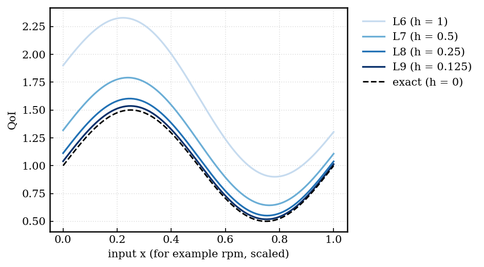
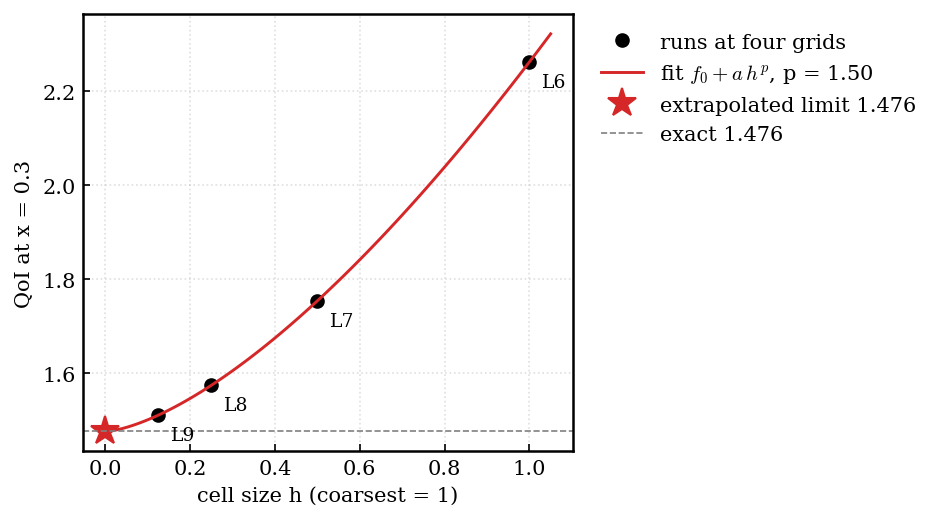
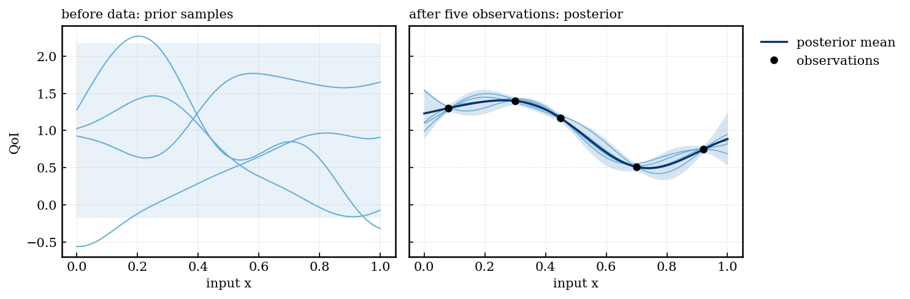
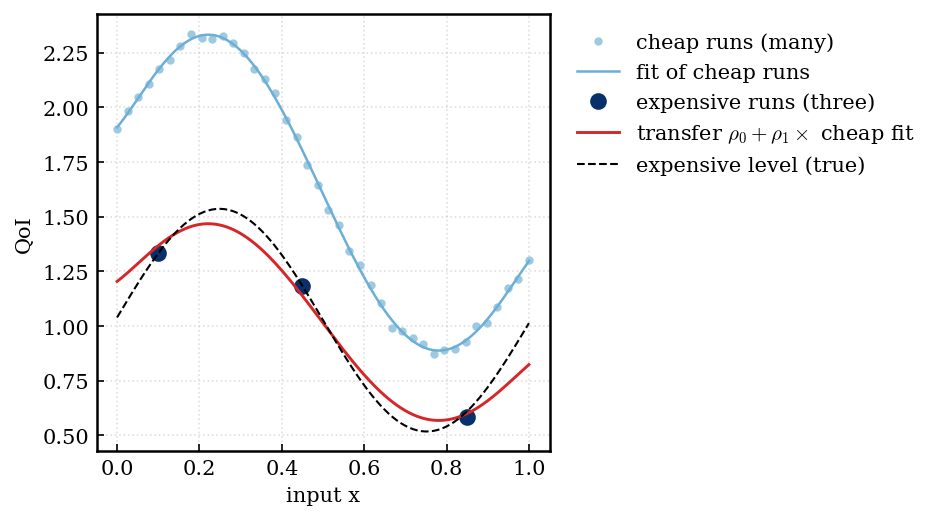
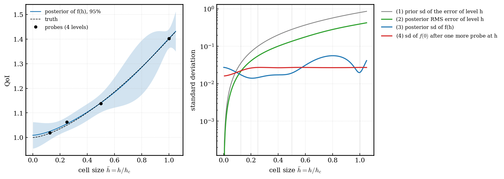
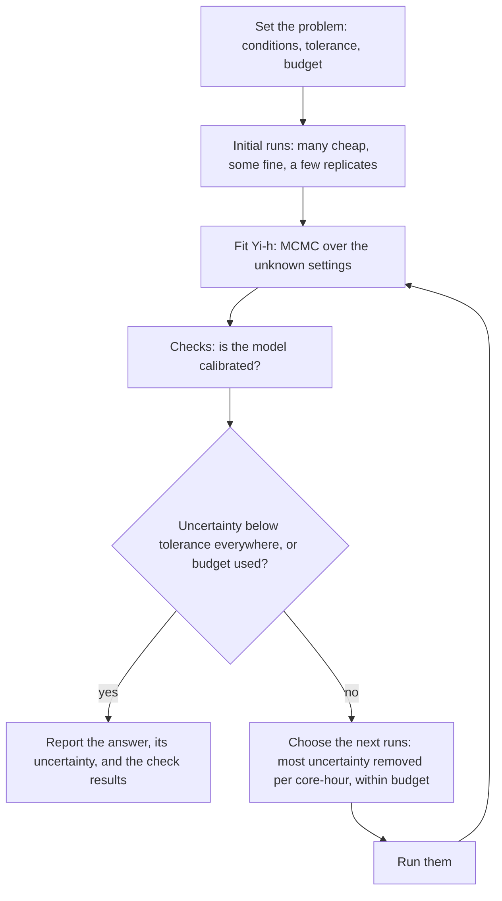
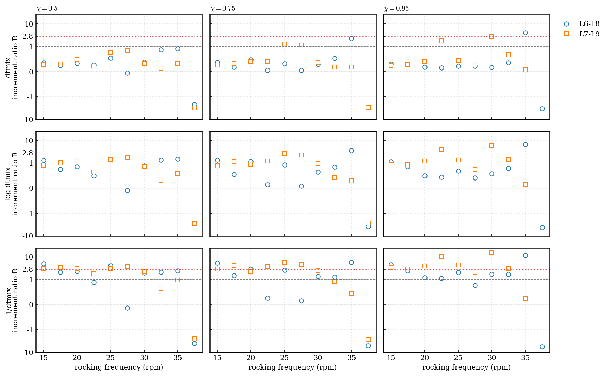
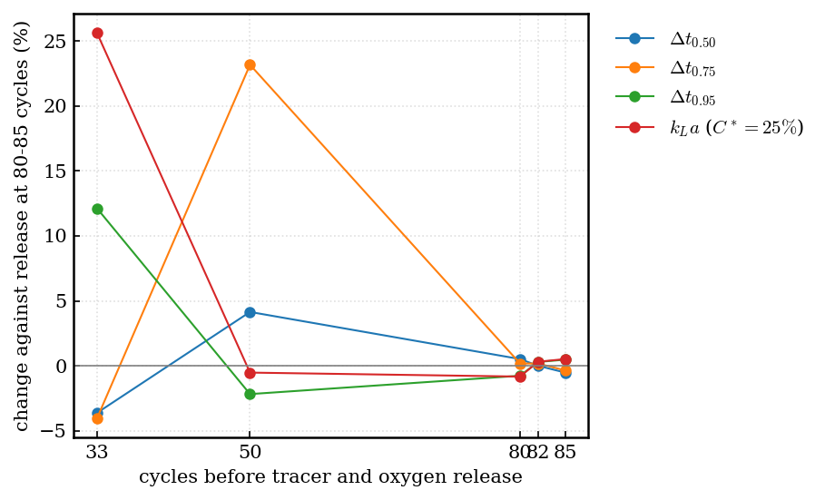
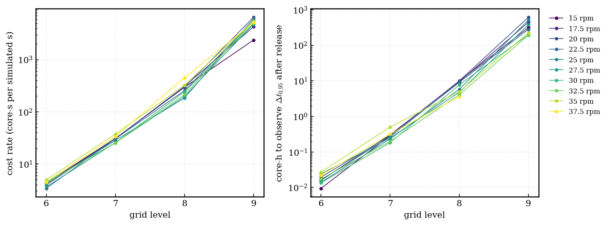

# Yi-h: a guide

This guide explains the method from first principles, for a reader who knows calculus, basic statistics and what a CFD grid is. Each idea has a picture and a small worked example. The precise specification (for implementation and review) is the closed section at the end of the page.

---

## 1. The problem

You run a CFD code of a rocking bioreactor. You want a quantity of interest (QoI), for example the mixing time, at every operating condition \(x\) (rocking speed, rocking angle). The code has a knob: the grid. Call the cell size \(h\).

- A **coarse grid** is cheap and wrong.
- A **fine grid** is expensive and less wrong.
- **No grid is exact.** The exact answer is the limit \(h \to 0\), which no run can reach.

*Fig. G1 (toy). The same QoI computed on four grids, L6 (coarsest) to L9 (finest), against the exact curve. Each refinement moves the curve closer to the exact one, by a smaller step each time.*

So the task has three parts:
1. **From several wrong answers to the exact one,** at one condition. This is grid convergence (Section 2).
2. **From a few conditions to all conditions.** This is regression, here with Gaussian processes (Section 3).
3. **Which run to buy next,** when a fine run costs about 20 to 50 times a coarser one, and the budget is fixed (Section 7).

The output must be a number with an honest error bar at every condition: "the mixing time at 25 rpm and 7° is 120 s ± 10%", where the ± covers everything we do not know.

---

## 2. Building block 1: grid convergence

**Why the error shrinks like \(h^p\).** A numerical scheme replaces derivatives by differences. A Taylor expansion shows that the error of a scheme of order \(p\) behaves like \(C h^p\) plus smaller terms when \(h\) is small. A QoI computed on a grid inherits this:

$$ f(h) \approx f(0) + a \, h^p $$

Here \(f(0)\) is the exact value, and \(a\) and \(p\) are unknown. When this approximation holds, we say the grids are in the **asymptotic range**.

**Worked example (Fig. G2).** Four grids, each with half the cell size of the one before: \(h = 1, 1/2, 1/4, 1/8\). The computed values are 2.262, 1.754, 1.574, 1.510.
- The differences between neighbours are 0.508, 0.180 and 0.064.
- If \(f(h) = f(0) + a h^p\), each difference is \(2^p\) times the next one. Here \(0.180 / 0.064 = 2.83 = 2^{1.5}\), so \(p = 1.5\).
- The remaining distance to the limit is a geometric series of further differences: \(f(0) = 1.510 - 0.064/(2^{1.5} - 1) = 1.476\).
- The exact value is 1.476.

This is **Richardson extrapolation.**

*Fig. G2 (toy). Four grids at one condition, the power-law fit, and the extrapolated limit (star).*

**What goes wrong with real data:**
- **Noise:** runs scatter, so the differences are uncertain.
- **Not yet asymptotic:** the ratio of differences changes from level to level.
- **Oscillation:** the differences change sign.

Eça & Hoekstra (2014) is a careful recipe for this case, for one QoI at one condition (you pointed us to it as the reference for discretisation uncertainty). They fit the power law by least squares over at least 4 grids. They choose the error model by the observed \(p\). They add a safety factor of 1.25 when the data behave well, or 3 when they do not.

**Our mixing time is in the "goes wrong" case.** In log space the ratio of differences is about 1, not \(2^p\) (Fig. D in Section 10). So L6 to L9 do not yet show convergence.

---

## 3. Building block 2: a Gaussian process in one page

**The idea.** A Gaussian process (GP) is a probability distribution over functions. You do not choose one curve. You state which curves are plausible, then let the data rule some out.

**The kernel** \(k(x, x')\) says how similar the values at two inputs are. A common choice makes nearby inputs similar and distant inputs nearly independent. Its **length scale** sets how quickly the function can change, and its **amplitude** sets how far it can move.

*Fig. G3 (toy). Left: before data, four curves drawn from the GP prior, with the 95% band. Right: after five observations, curves drawn from the posterior. The band is narrow near the observations and wider between them.*

**The update** is a formula. With observations \(y\) at inputs \(X\), observation noise \(s^2\), the matrix \(K = k(X, X)\), and the vector \(k_*\) of kernel values between a new input and \(X\):

$$ m(x) = k_*^T (K + s^2 I)^{-1} y $$

The posterior variance is \(k(x,x) - k_*^T (K + s^2 I)^{-1} k_*\).

You do not need to remember these formulas. Three facts matter:
1. The prediction is a weighted sum of the observations. Nearby observations get the larger weights.
2. The uncertainty is small near data and large far from data.
3. The kernel settings (length scale, amplitude) are themselves uncertain, and we learn them from the data (Section 6).

**The key step for us: a kernel along the grid axis.** We can treat \(h\) as one more input. A kernel in \(h\) that vanishes at \(h = 0\), for example one proportional to \((h h')^p\), says "the error goes to zero as the grid is refined". That puts Richardson extrapolation inside the GP. The GP then extrapolates to \(h = 0\) and tells us how sure it is.

---

## 4. Building block 3: multi-fidelity learning (Yi et al. 2024)

**The idea.** Cheap runs are many, and expensive runs are few. If the cheap and expensive results move together, the cheap runs carry the shape of the function, and a few expensive runs correct it. The classical form (Kennedy and O'Hagan) is "expensive = \(\rho\) × cheap + correction".

**Yi et al.'s KRR-LR-GPR** does this in three steps:
1. Fit the cheap data with kernel ridge regression (KRR), a fast deterministic fit.
2. Find a linear transfer \(\rho_0 + \rho_1 \times\) (cheap fit) from the expensive points (linear regression, LR).
3. Fit what is left, the residual \(r(x)\), with a GP (GPR), which gives the uncertainty.

*Fig. G4 (toy). Forty cheap runs (coarse grid) and three expensive runs (fine grid). Step 2 gives the red curve. It already has the right shape; the remaining gap to the true expensive level is what the residual GP of step 3 learns.*

**What it does not do for our problem:**
- It has two levels and no notion of a grid. In Yi's engineering example the two fidelities are different physics (Euler and RANS), not two grids.
- Its target is the expensive level, not the exact answer \(h = 0\).
- The cheap fit is a fixed estimate, so its own uncertainty does not reach the answer.

---

## 5. Putting it together: Yi-h

**The idea in one sentence:** every grid level is a "cheap model" of the exact answer, linked to it by Yi's linear transfer, and the transfer becomes exact as \(h \to 0\).

$$ \Lambda(y) = \rho_0(h) + \rho_1(h) \, \mu(x) + \delta(x, h) + e $$

Read it term by term:

| Term | Meaning | From |
|---|---|---|
| \(\mu(x)\) | the exact answer we want, as a GP over the conditions \(x\) | Yi's target, moved to \(h = 0\) |
| \(\rho_0(h)\), \(\rho_1(h)\) | the transfer between level \(h\) and the exact answer: \(\rho_0 = c_0 \bar h^p\) goes to 0 and \(\rho_1 = 1 + c_1 \bar h^p\) goes to 1 | Yi's linear transfer, now a function of the grid |
| \(\delta(x, h)\) | what the transfer misses at level \(h\); it also shrinks like \(\bar h^p\) | Yi's residual, now a function of the grid |
| \(e\) | run-to-run scatter | a noise model |
| \(\Lambda\) | an optional transform, for example \(\log\) for a positive QoI | a modelling choice |

Here \(\bar h\) is the cell size divided by the coarsest cell size, so \(\bar h = 1, 1/2, 1/4, ...\).

**Check with the toy of Fig. G1.** There, level \(h\) equals the exact curve plus \(h^{1.5}(0.6 + 0.3\cos 3x)\). That is exactly this form, with \(\rho_1 = 1\), \(p = 1.5\), and \(\delta\) carrying the \(x\)-dependent error.

**Why this is an extension of Yi.** Take only two levels, a coarse one and a fine one, and remove \(\mu\) from the two equations. What is left is "fine = \(\rho_0' + \rho_1'\) × coarse + a GP residual", which is Yi's model. Yi-h adds:
- any number of levels, all in one likelihood;
- the exact answer \(h = 0\) as the target;
- full Bayesian treatment: no plug-in fits, and the order \(p\) is learned with its uncertainty;
- a noise model whose size changes with the condition;
- cost-aware choice of the next runs (Section 7).

---

## 6. Two kinds of uncertainty, and learning the unknown settings

**Epistemic uncertainty** is what we do not know about the exact answer. More runs, finer runs, or runs at new conditions reduce it. The tolerance applies to this part.

**Aleatoric uncertainty** is how much repeated runs scatter. We measure it with replicates: the same run with the tracer released a few cycles later. More compute does not remove it, so we report it but do not bound it. Our first data: at L6 the scatter of the mixing time is 17% at 17.5 rpm, 1.2% at 25 rpm and 0.2% at 32.5 rpm. So the noise size must depend on the condition.

**What decreases as \(h \to 0\), and what does not (Fig. E below):**
- **The error of a grid level** decreases to zero (curve 1). This is "finer is closer to the truth", and the model guarantees it.
- **What one more run tells us** grows as the run gets finer (curve 4). This is "finer is more informative".
- **Our knowledge of the value at each level** is best where we have runs and worse elsewhere, including at \(h = 0\) (curve 3). This one must not decrease toward \(h = 0\). A model that claimed to know \(h = 0\), where no run exists, better than L9, where runs exist, would be overconfident.

*Fig. E (synthetic). Right: (1) the fidelity envelope, (2) the posterior error of each level, (3) the posterior sd of each level, (4) the sd of the exact answer after one more run at \(h\).*

**Learning the unknown settings.** The model has settings we do not know: the order \(p\), the length scales, the amplitudes. The order \(p\) matters most, because it decides how far to extrapolate. A single best guess of \(p\) hides that uncertainty.
- So we draw many plausible settings with Markov chain Monte Carlo (MCMC), weighted by how well they explain the data, and average the predictions over them.
- **Several model variants** (two kernel families, several transforms) are combined by **stacking**: each variant gets a weight by how well it predicted a held-out finer level.

---

## 7. Choosing the next run

**The value of a run** is how much it is expected to shrink the uncertainty of the exact answer, summed over all conditions, per core-hour.

- A cheap coarse run adds little about \(h = 0\).
- A fine run adds much more, but it costs much more.
- The method compares value per cost over all candidate runs: every condition, at every grid level, including levels finer than any run so far.

**A rough example from our cost data** (core-hours for one mixing-time run, without spin-up): L7 0.25, L8 6, L9 300, L10 about 3,600. If an L10 run would shrink the uncertainty at \(h = 0\) ten times more than an L9 run, it is still worth less per core-hour, because it costs twelve times more.

**The budget is a hard limit.** A run is allowed only if its 95% cost estimate fits in the budget that is left. A run that hits its cost cap is stopped and still counts.

**Stop** when the uncertainty is below the tolerance at every condition, or when the budget is used. In the second case, report the best answer reached and say that the tolerance was not met.

---

## 8. The loop

**The checks, in plain words:**
- **G0, convergence:** do the data show a clear order \(p\)? If not, the answer at \(h = 0\) stays uncertain, and the method will prefer finer runs.
- **G1, prediction of a finer level:** hide the finest level, predict it from the others, and compare. This is the closest test we have of extrapolation.
- **G2, leave one run out:** predict each run from all the others.
- **G3, noise:** does the scatter of replicates match the noise model?
- **G4, coarsest level:** does removing the coarsest level change the answer? If yes, that level is not yet asymptotic.
- **G5, shape:** quantities that must increase (mixing time with mixing level) do increase.
- **G6, Gaussian shape:** is "mean ± sd" a fair summary of the uncertainty?
- **G7, prior influence:** does the answer change much when the prior settings change? If yes, the data are too weak.

---

## 9. Using the structure of a problem

The core method needs none of these. Each one is optional, and each one states its assumption.

| Structure | What it buys | Bioreactor example |
|---|---|---|
| One run gives many outputs | the mixing time at all mixing levels comes from one run | \(\Delta t\) at χ = 0.5, 0.75 and 0.95 |
| Runs can be paused and resumed | extend a promising run instead of starting again | checkpoints |
| Start a fine run from a coarse state | skip part of the start-up time | allowed only with a full settling period (Section 10) |
| Several grids in one code | a finer grid only where it is needed | the tracer on a finer grid than the flow |
| Several QoIs per run | one run informs kLa, mixing time and shear together | kLa and \(\Delta t\) |
| A known sign or range | a mixing rate is positive | built into the prior |

---

## 10. What our data say so far

- **Mixing time does not converge yet on L6–L9 (Fig. D).** For three neighbouring grids, the ratio of differences must be about \(2^p > 1\). In log space it is about 1. So the method will want finer runs.
- **kLa converges plausibly** on the same grids.
- **The start-up length matters (Fig. F).** Releasing the tracer after 33 or 50 cycles instead of 80 changes kLa by up to 26% and \(\Delta t\) by up to 23%. Releases after 80, 82 and 85 cycles agree within 1%. So every run must settle for the full 80 cycles.
- **The one L10 run** gave about half the L9 mixing time. It reached its release through a restart that is known to disturb the flow. A test at L8 with the same restart history is running.
- **The cost per grid level** grows by 7× to 21× per simulated second, and by 17× to 50× per mixing-time run (Fig. C).

*Fig. D. Ratio of grid-to-grid differences per rpm, for L6–L8 (circles) and L7–L9 (squares). Rows: \(\Delta t\), \(\log \Delta t\), \(1/\Delta t\). Dashed: 1, no convergence. Dotted: 2.8, order 1.5.*

*Fig. F. Change of each QoI when the tracer is released after 33 or 50 cycles instead of 80–85 (L8, 32.5 rpm).*

*Fig. C. Measured cost per grid level.*

---

## 11. Where this sits in the literature

Our problem has two halves, and each half has its own literature. Every statement below comes from the method sections of the cited papers, read in this project. "Not in the papers read" is not the same as "nobody has done it".

**Half 1: how far is one computed number from the converged value?** This is solution verification, at one fixed condition.
- **Eça & Hoekstra (2014)** fit \(f_0 + a h^p\) by least squares over at least 4 grids, and add a safety factor. The method is deterministic and gives one number at one condition.
- **Probabilistic Richardson extrapolation** (Oates et al., arXiv 2401.07562) puts a GP on \(h\) with a kernel that vanishes at \(h = 0\), and estimates the rate. Its Theorem 2 shows that it can be more accurate than plain Richardson. Design inputs enter only as an index on a fixed grid (its §2.10).
- **Sparse PRE** (2604.02072) chooses the next resolutions sequentially under a cost budget, at one condition.

**Half 2: how do we predict over all conditions from cheap and expensive runs?** This is multi-fidelity regression. **In every paper of this half that we read, the target is the most expensive fidelity that was run, not \(h = 0\).**
- **Yi et al. (2407.15110)** use two fidelities, with KRR for the cheap one, a linear transfer, and a GP residual. Their engineering example uses Euler as the cheap fidelity and RANS as the expensive one.
- **Co-kriging for aerodynamic design** (Schouler et al., 2505.17279) uses a high-fidelity grid that was refined beforehand "until achieving grid convergence".
- **Deep-GP multi-fidelity Bayesian optimisation** (Savage et al., 2210.17213) uses five mesh levels and optimises at the highest.
- **Neural multi-fidelity models for PDE fields** (IFC 2207.00678; DGMF 2311.05606; DMFAL 2012.00901 and its budgeted batch version BMFAL-BC 2210.12704) map fidelity to a continuous variable or to discrete levels.
  - They predict the highest training fidelity.
  - IFC tests extrapolation to one finer mesh, and the evidence is empirical only.

**Joining the two halves: the target \(h = 0\) over a design region.** A small line of work makes the cell size an input of a GP and predicts the converged value at all conditions:

| Work | Rate \(p\) | Inference | Sequential, cost-aware design | Noise |
|---|---|---|---|---|
| Tuo, Wu & Yu 2014 (restated in CONFIG §2.4) | Brownian-type kernel; with it, the extrapolation equals the finest level (Bect et al. 2103.14559 §2.2) | not checked (paper not on arXiv) | not checked | no (deterministic code) |
| CONFIG, Ji et al. (2209.13748) | from numerical analysis, ML, or fully Bayesian | GP | no ("future work") | no |
| Boutelet & Sung (2503.23158), **closest** | **fixed in advance** from numerical analysis | plug-in REML | yes: IMSPE reduction per cost, one run at a time | no |
| DNA, Heo et al. (2506.08328) | none; a first-order error term remains | plug-in MLE | one-shot allocation | no |
| Stroh et al. (1605.02561, 1709.06896, 1707.08384, 2007.13553) | Brownian-type; its exponent is sampled in 1709.06896 | fully Bayesian (1709.06896) | yes (MR-SUR, MSUR) | yes, per level |

The Stroh models contain the \(h = 0\) limit, but the quantity they predict in their applications is at the finest level run (1707.08384 eq 1).

**What Yi-h adds**, in the papers read, is the combination of four things that no single paper there has:
1. a design region of up to about 10 inputs;
2. a convergence rate that is learned, with its uncertainty carried into the answer;
3. a calibrated Bayesian uncertainty of the \(h = 0\) value, checked by predicting a held-out finer level;
4. a sequential choice of both the condition and the resolution, under a hard budget.

In addition, Yi-h carries Yi's linear transfer into every level, as \(\rho(h)\), and it uses a noise model whose size changes with the condition.

None of the papers read reports the coverage of a predicted \(h = 0\) value over a design region against a known limit of a real simulator. That calibration is the hardest part to show, and Gate G1 is our practical substitute.
