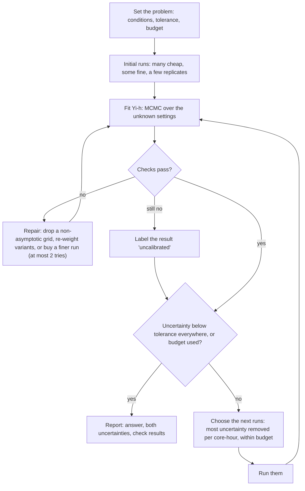

# Yi-h: a guide

This guide explains the method from first principles. It assumes calculus, basic statistics, least squares, and what a CFD grid is. Each idea comes with a picture and a small worked example. The precise specification, for implementation and review, is the closed section at the end of the page.

Figures T1–T4 are toy problems with known answers. Figures C–F use our bioreactor data. "Gate G0–G7" are the model checks of Section 8.

---

## 1. The problem

We simulate a rocking bioreactor: a bag, half full of liquid, rocked back and forth. One **cycle** is one back-and-forth rocking period. We want **quantities of interest (QoIs)** such as:
- the **mixing time** \(\Delta t_\chi\): the time a dye (tracer) needs to mix to level \(\chi\). For example, \(\chi = 0.95\) means that 95% of the initial non-uniformity is gone;
- the **mass-transfer coefficient** \(k_La\): how fast oxygen enters the liquid.

We want them at every operating condition \(x\), such as the rocking speed (rpm) and the rocking angle.

The code has a knob: the **cell size** \(h\) of the grid. Levels L6, L7, L8, L9 each halve the cell size of the one before.
- A **coarse grid** is cheap and wrong.
- A **fine grid** is expensive and less wrong.
- **No grid is exact.** The exact answer of the model equations is the limit \(h \to 0\), which no run can reach.

*Fig. T1 (toy). One QoI computed on four grids, L6 (coarsest) to L9 (finest), against the exact curve. Each refinement moves the curve closer to the exact one, and each step is smaller than the one before.*

The task has three parts:
1. **From several wrong answers to the exact one,** at one condition. This is grid convergence (Section 2).
2. **From a few conditions to all conditions.** This is regression; we use Gaussian processes (Section 3).
3. **Which run to buy next,** when a run on the next finer grid costs 17 to 50 times more, and the compute budget is fixed (Section 7).

The output must be a number with an honest error bar at every condition. For example: "at 25 rpm and 7°, the mixing time is 120 s ± 10%", where the ± covers everything we do not know.

---

## 2. Building block 1: grid convergence

**Why the error shrinks like \(h^p\).** A numerical scheme replaces derivatives by differences. A Taylor expansion shows that the error of a scheme of order \(p\) is \(C h^p\) plus smaller terms, when \(h\) is small. A QoI computed on that grid inherits this:

$$ f(h) \approx f(0) + a \, h^p $$

\(f(0)\) is the exact value. \(a\) and \(p\) are unknown. When this approximation holds, the grids are in the **asymptotic range**.

**How to find \(p\) and \(f(0)\).** Compare two grids that differ by a factor 2:

$$ f(h) - f(h/2) = a h^p (1 - 2^{-p}) $$

So each difference between neighbouring grids is \(2^p\) times the next one. Call this ratio \(R\). Three unknowns (\(f(0)\), \(a\), \(p\)) need three grids. A fourth grid checks the result: in the asymptotic range, the two ratios agree.

**Worked example (Fig. T2).**
- Four grids with \(h = 1, 1/2, 1/4, 1/8\) give 2.2620, 1.7536, 1.5738, 1.5103.
- The differences are 0.5084, 0.1798 and 0.0635.
- The ratios are \(0.5084/0.1798 = 2.828\) and \(0.1798/0.0635 = 2.832\). They agree, so the grids are in the asymptotic range, and \(R = 2.83 = 2^{1.5}\) gives \(p = 1.5\).
- The rest of the way to \(h = 0\) is a geometric series of ever smaller differences, which sums to \(0.0635/(2^{1.5} - 1)\). So \(f(0) = 1.5103 - 0.0635/1.828 = 1.4756\).
- The exact value is 1.4755. The difference is only rounding.

This is **Richardson extrapolation.**

*Fig. T2 (toy). Four grids at one condition, the power-law fit, and the extrapolated limit (star).*

**What goes wrong with real data:**
- **Noise:** repeated runs scatter, so the differences are uncertain.
- **Not yet asymptotic:** the two ratios disagree.
- **Oscillation:** the differences change sign (\(R < 0\)).

**Eça & Hoekstra (2014)** is a careful recipe for this, for one QoI at one condition. They:
- fit the power law by least squares over at least 4 grids;
- choose the **error model**, the form of \(f(h)\) to fit (free \(p\); or fixed \(p = 1\) or 2; or two terms), from the observed \(p\);
- report an uncertainty \(U = F_s \lvert \varepsilon \rvert\), where \(\varepsilon\) is the estimated error of the finest grid and the **safety factor** \(F_s\) is 1.25 when the data behave well and 3 when they do not.

---

## 3. Building block 2: a Gaussian process

**The idea.** A Gaussian process (GP) is a probability distribution over functions. Instead of choosing one curve, you state which curves are plausible. Then the data rule some of them out.

**Definition.** \(f\) is a GP if, for any finite set of inputs \(x_1, ..., x_n\), the values \(f(x_1), ..., f(x_n)\) are jointly Gaussian. Their means are \(m_0\) (a constant here), and their covariances are given by a **kernel** \(k(x_i, x_j)\).

**A concrete kernel** (the one of Fig. T3):

$$ k(x, x') = 0.6^2 \exp(-(x - x')^2 / (2 \cdot 0.2^2)) $$

- **0.6 is the amplitude:** the typical size of the departures from \(m_0\).
- **0.2 is the length scale:** two inputs closer than about 0.2 have similar values; inputs much farther apart are nearly independent.

**Prior, likelihood, posterior.**
- The **prior** is the GP before data: Fig. T3, left.
- The **likelihood** says how the observations relate to \(f\): \(y_i = f(x_i) + \) noise, with noise sd \(s\).
- **Bayes' rule** combines them into the **posterior**: the GP after the data, Fig. T3, right.

*Fig. T3 (toy). Left: before data, four curves drawn from the prior, and the 95% band (mean ± 1.96 sd). Right: after five observations, curves drawn from the posterior. The band is narrow near the observations and wide between them.*

**Where the formulas come from: one observation.** Take one observation \(y_1\) at \(x_1\). The values \(f(x)\) and \(y_1\) are jointly Gaussian. For two jointly Gaussian values \(A\) and \(B\), knowing \(B = b\) changes the mean and the variance of \(A\) to

$$ E[A \mid b] = E[A] + (b - E[B]) \, Cov(A, B) / Var(B), \qquad Var(A \mid b) = Var(A) - Cov(A, B)^2 / Var(B) $$

Here \(A = f(x)\) and \(B = y_1\), with \(Cov(f(x), y_1) = k(x, x_1)\) and \(Var(y_1) = k(x_1, x_1) + s^2\). So:

$$ m(x) = m_0 + k(x, x_1) (y_1 - m_0) / (k(x_1, x_1) + s^2) $$

- If \(x\) is near \(x_1\), then \(k(x, x_1)\) is large, so the prediction moves toward \(y_1\).
- If \(x\) is far from \(x_1\), then \(k(x, x_1) \approx 0\), so the prediction stays at \(m_0\), and the band keeps its prior width.

**With \(n\) observations** the same rule gives a matrix form. \(K\) is the matrix of \(k(x_i, x_j)\), and \(k_*\) is the vector of \(k(x, x_i)\):

$$ m(x) = m_0 + k_*^T (K + s^2 I)^{-1} (y - m_0) $$

The posterior variance is \(k(x,x) - k_*^T (K + s^2 I)^{-1} k_*\). The 95% band is \(m(x) \pm 1.96\) sd.

Three facts matter more than the formulas:
1. The prediction is a weighted sum of the observations, and nearby observations get larger weights.
2. The uncertainty is small near data and large far from data.
3. The kernel settings (amplitude, length scale) are themselves unknown. We learn them from the data (Section 6).

**A kernel along the grid axis.** We can make \(h\) one more input. The QoI is "exact value plus error":

$$ f(x, h) = f(x, 0) + \mathrm{error}(x, h) $$

We put a GP on the **error term**, with a kernel in \(h\) proportional to \((h h')^p\). Its variance at one \(h\) is \(k(h, h) \propto h^{2p}\). So the error's sd shrinks like \(h^p\) and is exactly zero at \(h = 0\). This puts Richardson extrapolation inside the GP. The GP then predicts \(f(x, 0)\) and says how sure it is.

---

## 4. Building block 3: multi-fidelity learning (Yi et al. 2024)

**The idea.** Cheap runs are many, and expensive runs are few. If cheap and expensive results move together, the cheap runs carry the shape of the function, and a few expensive runs correct it. The classical form (Kennedy and O'Hagan) is "expensive = \(\rho \times\) cheap + correction".

**Yi et al.'s KRR-LR-GPR** has three steps:
1. Fit the cheap data with **kernel ridge regression (KRR)**. This is the GP posterior mean of Section 3 without the variance: a fast fit, with no uncertainty.
2. A **linear transfer** (LR), \(\rho_0 + \rho_1 \times\) (cheap fit).
3. A **GP on the residual**, \(r(x)\): what the transfer misses at the expensive points. This step gives the uncertainty.

In Yi's algorithm, the coefficients of step 2 are found together with the GP of step 3, by generalised least squares (Yi, Algorithm 1, step 2.1).

*Fig. T4 (toy). Forty cheap runs on the coarsest grid and four expensive runs on the finest grid. The transfer alone (orange) is off by up to 0.27. The residual GP (red, with its 95% band) corrects it to within 0.03, and the true expensive level stays inside the band.*

**What it does not do for our problem:**
- It has two levels and no notion of a grid. In Yi's engineering example the two fidelities are different physics (Euler equations and RANS), not two grids.
- Its target is the expensive level, not the exact answer \(h = 0\).
- The cheap fit has no uncertainty, so its errors do not show in the final error bar.

---

## 5. Putting it together: Yi-h

**The idea in one sentence:** every grid level is a "cheap model" of the exact answer, linked to it by Yi's linear transfer, and the transfer becomes exact as \(h \to 0\).

$$ \Lambda(y) = \rho_0(h) + \rho_1(h) \, \mu(x) + \delta(x, h) + e $$

| Term | Meaning |
|---|---|
| \(y\) | the result of one run at condition \(x\) on grid \(h\) |
| \(\Lambda\) | an optional transform, chosen per QoI. With \(\Lambda = \log\), a relative error ("10% too fast") becomes an additive one, which suits positive QoIs such as times and rates. |
| \(\mu(x)\) | the exact answer we want, in \(\Lambda\) units. The reported answer is \(\Lambda^{-1}(\mu(x))\), which is the **median** result of a run at \(h = 0\): the noise is symmetric in \(\Lambda\) units, so \(\mu\) is the median of \(\Lambda(y)\), and a monotone \(\Lambda^{-1}\) keeps medians. |
| \(\rho_0(h) = c_0 \bar h^p\) | an offset that vanishes as \(h \to 0\) |
| \(\rho_1(h) = 1 + c_1 \bar h^p\) | a scale that becomes 1 as \(h \to 0\) |
| \(\delta(x, h)\) | the rest of the grid error, a GP that also shrinks like \(\bar h^p\) |
| \(e\) | run-to-run scatter (Section 6) |

- \(\bar h\) is the cell size divided by the coarsest cell size, so \(\bar h = 1, 1/2, 1/4, ...\).
- \(c_0\), \(c_1\) and \(p\) are constants learned from the data.

**Why both \(\rho\) and \(\delta\).**
- \(\rho\) carries the part of the grid error that is **proportional to the answer**. For example, with \(\Lambda\) the identity, "the coarse grid gives a mixing time 30% too short at every condition" is a scale \(\rho_1 = 0.7\). (With \(\Lambda = \log\), the same error is an offset, \(\rho_0 = \log 0.7\).)
- \(\delta\) carries the part whose **shape changes** with the condition. For example, the error is large at low rpm and small at high rpm.
- Both vanish as \(h \to 0\), so the exact answer is \(\mu\).

**Check with the toy of Fig. T1.** There, level \(h\) equals the exact curve plus \(h^{1.5}(0.6 + 0.3\cos 3x)\). This is the form above with \(\Lambda\) the identity, \(c_1 = 0\), \(\rho_0 = 0.6 \bar h^{1.5}\), \(\delta = 0.3 \cos(3x) \bar h^{1.5}\) and no noise. Note that the constant 0.6 could also sit inside \(\delta\). The data cannot tell these two apart, so only their sum is learned well. That is harmless, because the answer \(\mu\) does not depend on the split.

**How this relates to Yi.** Take two grids, a coarse one and a fine one, and remove \(\mu\) from their two equations. The result has **Yi's form**: fine = \(\rho_0' + \rho_1'\) × coarse + residual. But the residual contains the coarse grid's own error, so it is correlated with the coarse result. Yi's model assumes a residual that is independent of the cheap fit. So Yi-h equals Yi's model only when the coarse grid's \(\delta\) is zero, or when the residual happens to be uncorrelated with the coarse result. In kernel terms, the second case needs \(k_h(h_f, h_c) = \rho_1' k_h(h_c, h_c)\), and that does not hold in general. Otherwise, Yi's fitted \(\rho\) absorbs part of the grid error. The specification lists the remaining conditions (Specification, Section 2.2).

**What Yi-h adds to Yi:**
- any number of grids, all in one likelihood;
- the exact answer \(h = 0\) as the target;
- full Bayesian treatment: no fixed plug-in fits, and the order \(p\) is learned together with its uncertainty;
- a noise model whose size changes with the condition;
- a cost-aware choice of the next runs (Section 7).

---

## 6. Two kinds of uncertainty, and learning the unknown settings

**Epistemic uncertainty** is what we do not know about the exact answer. More runs, finer runs, or runs at new conditions reduce it. The tolerance applies to this part.

**Aleatoric uncertainty** is how much repeated runs scatter.
- We measure it with **replicates**: the same run with the tracer released a few cycles later.
- More compute cannot remove it, so we report it but do not bound it.
- Our data (three runs per point, so each value is rough): at L6, the scatter of \(\Delta t_{0.95}\) is 17% at 17.5 rpm, 1.2% at 25 rpm and 0.25% at 32.5 rpm. From L6 to L8 it shrinks at 17.5 rpm (17% to 2%), but not at 25 or 32.5 rpm (0.15–2% at every level). So the size of the noise must be allowed to change with the condition, and with the grid in either direction.

**What decreases as \(h \to 0\), and what does not (Fig. E).**

*Fig. E (synthetic). Left: runs on four grids (dots), the posterior of \(f(h)\) (blue, with its 95% band), and the truth (dashed). Right: four standard deviations against \(h\).*

- **Curve 1, the fidelity envelope:** how large the error of a level-\(h\) run can be, under the model. It decreases to zero, and the model guarantees that by construction. This is "finer is closer to the truth".
- **Curve 2, the estimated error of each level:** how far each level is from the truth, as the data suggest. It is zero at \(h = 0\) and follows the true error, so it decreases only when the true convergence does. It would not decrease monotonically for a grid sequence that oscillates.
- **Curve 3, our knowledge of each level:** the posterior sd of \(f(h)\). It is smallest where runs exist and larger elsewhere, including at \(h = 0\). This one **must not** decrease toward \(h = 0\). A model that claimed to know \(h = 0\), where no run exists, better than L9, where runs exist, would be overconfident.
- **Curve 4, the value of one more run:** the sd of the exact answer that would remain after one more run at grid \(h\). It is lower for finer runs. This is "finer is more informative".

**Learning the unknown settings.** The model has settings we do not know: \(p\), \(c_0\), \(c_1\), the kernel amplitudes and length scales, and the noise level. The order \(p\) matters most, because it decides how far to extrapolate. A single best guess of \(p\) would hide that uncertainty.
- **Markov chain Monte Carlo (MCMC)** draws thousands of combinations of settings, each in proportion to (prior probability) × (how well it explains the data). The final answer is the average of the predictions over these draws. So the uncertainty about \(p\) appears in the error bar.

**Several model variants.** We try two families of kernel in \(h\):
- one that behaves like Richardson extrapolation (called TWY2);
- one in which the errors of neighbouring grids can be more or less alike (the "lifted Brownian" kernel, LB).

We also try several transforms \(\Lambda\). The variants are combined by **stacking**:
1. Each variant is fitted without the finest grid. The finest grid's runs are **held out**: hidden from the fit.
2. Each variant predicts those hidden runs.
3. The variants that predicted them better get larger weights.

---

## 7. Choosing the next run

**The value of a run** is how much it is expected to shrink the epistemic uncertainty of the exact answer, summed over all conditions, divided by its cost in core-hours.

**This value can be computed before the run.** For fixed settings, the posterior variance of a GP after a new observation depends on where the observation is, not on what it turns out to be. The parts that do depend on the outcome (for example, how much the run would teach us about \(p\)) are averaged over many simulated outcomes.

**Candidates** are every condition at every grid, including grids finer than any run so far.

**A hypothetical example.** Our measured cost per mixing-time run grows about 50× from L8 to L9 (Fig. C, right). Suppose one more run at the next finer grid costs 50 times a run at the current finest grid. If it removed 10 times more uncertainty, it would still be worth 5 times less per core-hour. So the method buys a finer run only when it is worth its price.

**This choice is only as good as the value estimate.** In particular, the method must value runs on untried finer grids correctly. Before the first real campaign, we test that on synthetic problems with a known answer (assumption A12 in the specification).

**The budget is a hard limit.** A run is allowed only if a pessimistic (95%) estimate of its cost fits in the budget that is left. A run that reaches its cost cap is stopped and still counts.

---

## 8. The loop and the checks

**Success needs both:** the uncertainty is below the tolerance at every condition, **and** the checks pass. A result whose checks still fail after two repairs is reported, but labelled "uncalibrated".

**The checks, in plain words:**
- **G0, convergence:** do the data show a clear order \(p\)? If not, the answer at \(h = 0\) stays uncertain, and the method is expected to buy finer runs (if A12 holds).
- **G1, prediction of a finer grid:** hide the finest grid, predict it from the others, and compare. This is the closest test we have of extrapolation toward \(h = 0\). It needs enough runs on the finest grid; with too few, it is reported as "not testable".
- **G2, leave one run out:** predict each run from all the others.
- **G3, noise:** does the scatter of the replicates match the noise model?
- **G4, coarsest grid:** does removing the coarsest grid change the answer? If yes, that grid is not yet in the asymptotic range, and it is removed.
- **G5, shape:** a quantity that must increase (the mixing time with \(\chi\)) does increase.
- **G6, Gaussian shape:** is "mean ± sd" a fair summary of the uncertainty?
- **G7, prior influence:** does the answer change much when the prior settings change? If yes, the data are too weak to decide.

---

## 9. Using the structure of a problem

The core method needs none of these. Each one is optional, and each one states its assumption (Specification, Section 4).

| Structure | What it buys | Bioreactor example |
|---|---|---|
| One run gives many outputs | the mixing time at all mixing levels from one run | \(\Delta t\) at χ = 0.5, 0.75 and 0.95 |
| Runs can be paused and resumed | extend a promising run instead of starting again | checkpoints |
| A fine run can start from a coarse state | skip part of the start-up time | allowed only with a full settling period (Section 10) |
| Several resolutions in one code | a finer grid only where it is needed | the tracer on a finer grid than the flow |
| Several QoIs per run | one run informs kLa, mixing time and shear | kLa and \(\Delta t\) |
| A known sign or range | a mixing rate must be positive | built into the prior |

---

## 10. What our data say so far

**Mixing time does not converge yet on L6–L9 (Fig. D).** For three neighbouring grids, \(R\) is the ratio of their two differences (Section 2). Convergence with order \(p\) needs \(R \approx 2^p > 1\).
- **\(\Delta t\) itself:** \(R\) is 0.2–0.4, so the differences **grow** with refinement.
- **\(\log \Delta t\):** \(R \approx 1\), so the differences do not shrink.
- **The rate \(1/\Delta t\):** \(R\) is 1.5–3.4, which looks like convergence. But in all 22 grid triplets (L7–L9), Richardson extrapolation gives a rate below the L9 rate, from 0.98 to −2.3 times it. In 9 triplets it is negative, which is impossible. So the power law does not hold yet on these grids, and the converged value is **not identified**: the data say only that the converged mixing time is longer than at L9, by a factor they cannot fix.

**kLa converges plausibly** on the same grids.

**The start-up length matters (Fig. F).** Each run rocks for 80 cycles before the tracer is released, as in Kim et al.'s protocol.
- Releasing after 33 or 50 cycles changes kLa by up to 26%, and \(\Delta t\) by up to 23%.
- Releases after 80, 82 and 85 cycles agree within 1%.
- So every run, including a run started from a coarser state, must settle for the full 80 cycles.

**The one L10 run** gave about half the L9 mixing time. It reached its release through a checkpoint restart that is known to disturb the flow. A test at L8 with the same restart history is running.

**Cost** grows by 7× to 21× per grid level per simulated second, and by 17× to 50× per mixing-time run (Fig. C).

*Fig. D. The ratio \(R\) for each rpm, for L6–L8 (circles) and L7–L9 (squares). Columns: \(\chi\) = 0.5, 0.75, 0.95. Rows: \(\Delta t\), \(\log \Delta t\), \(1/\Delta t\). The vertical axis is linear between −1 and 1 and logarithmic outside. Dashed line: R = 1, no convergence. Dotted line: R = 2.8, order 1.5.*

*Fig. F. Change of each QoI when the tracer is released after 33 or 50 cycles instead of 80–85 cycles (L8, 32.5 rpm).*

*Fig. C. Measured cost, L6–L9, all rpm. Left: core-seconds per simulated second. Right: core-hours to observe \(\Delta t_{0.95}\) after release (spin-up not included).*

---

## 11. Where this sits in the literature

Our problem has two halves, and each half has its own literature. Every statement below comes from the method sections of the cited papers, read in this project. "Not in the papers read" does not mean "nobody has done it".

**Half 1: how far is one computed number from the converged value?** This is solution verification, at one fixed condition.
- **Eça & Hoekstra (2014)** fit \(f_0 + a h^p\) by least squares over at least 4 grids, and add a safety factor (Section 2). The result is one number with an uncertainty, at one condition.
- **Probabilistic Richardson extrapolation** (Oates et al., arXiv 2401.07562) puts a GP on \(h\), with a kernel that vanishes at \(h = 0\), and estimates the rate.
  - Its Theorem 2 shows that it converges faster than the raw numerical method.
  - Its Remark 3 notes that it needs more grids than classical Richardson extrapolation does.
  - Design inputs enter only as an index on a fixed grid (its §2.10).
- **Sparse PRE** (2604.02072) chooses the next resolutions one at a time under a cost budget, at one condition.

**Half 2: how do we predict over all conditions from cheap and expensive runs?** This is multi-fidelity regression. **In every paper of this half that we read, the target is the most expensive fidelity that was run, not \(h = 0\).**
- **Yi et al. (2407.15110)** use two fidelities: KRR for the cheap one, a linear transfer, and a GP residual. Their engineering example has Euler as the cheap fidelity and RANS as the expensive one.
- **Co-kriging for aerodynamic design** (Schouler et al., 2505.17279) uses a high-fidelity grid that was refined beforehand "until achieving grid convergence".
- **Deep-GP multi-fidelity Bayesian optimisation** (Savage et al., 2210.17213) uses five mesh levels and optimises at the highest.
- **Neural multi-fidelity models for PDE fields** (IFC 2207.00678; DGMF 2311.05606; DMFAL 2012.00901 and its budgeted batch version BMFAL-BC 2210.12704) treat fidelity as discrete levels or as a continuous variable. They predict the highest training fidelity. IFC tests extrapolation to one finer mesh, and the evidence is empirical only.

**Terms used below:** co-kriging is a GP model of two fidelities linked by a linear transfer (the Kennedy–O'Hagan form). MLE, ML and REML are maximum-likelihood point estimates of the model settings (REML is a restricted variant). MR-SUR and MSUR choose the run with the largest expected reduction of uncertainty per unit of cost.

**Joining the two halves: the target \(h = 0\) over a design region.** A small line of work makes the cell size an input of a GP, and predicts the converged value at all conditions:

| Work | Rate \(p\) | Inference | Sequential, cost-aware design | Noise model |
|---|---|---|---|---|
| Tuo, Wu & Yu 2014 (restated in CONFIG §2.4) | Brownian-type kernel; with it, the extrapolation equals the finest grid (Bect et al. 2103.14559 §2.2) | not checked (not on arXiv) | not checked | no (deterministic code) |
| CONFIG, Ji et al. (2209.13748) | from numerical analysis, ML, or fully Bayesian | GP | no ("future work") | no |
| Boutelet & Sung (2503.23158), **closest** | **fixed in advance** from numerical analysis | plug-in REML | yes: integrated variance reduction per cost, one run at a time | no |
| DNA, Heo et al. (2506.08328) | none; a first-order error term remains | plug-in MLE | one-shot allocation | no |
| Stroh et al. (1605.02561, 1709.06896, 1707.08384, 2007.13553) | Brownian-type; its exponent is sampled in 1709.06896 | fully Bayesian (1709.06896) | yes (MR-SUR, MSUR) | yes, per level |

The Stroh models contain the \(h = 0\) limit, but the quantity they predict in their applications is at the finest level run (1707.08384 eq 1).

**What Yi-h adds**, in the papers read, is the combination of four things that no single paper there has:
1. a design region of up to about 10 inputs;
2. a convergence rate that is learned, with its uncertainty carried into the answer;
3. a Bayesian uncertainty of the \(h = 0\) value, checked by a proxy: the prediction of a held-out finer grid (Gate G1);
4. a sequential choice of both the condition and the grid, under a hard budget.

Yi-h also carries Yi's linear transfer into every grid, as \(\rho(h)\), and it lets the size of the noise change with the condition.

None of the papers read reports how often the error bar of a predicted \(h = 0\) value covers the true limit, over a design region of a real simulator. That calibration is the hardest part to show. Gate G1 is our practical proxy, and whether a proxy at one finer grid carries over to \(h = 0\) is an assumption (A13 in the specification).
