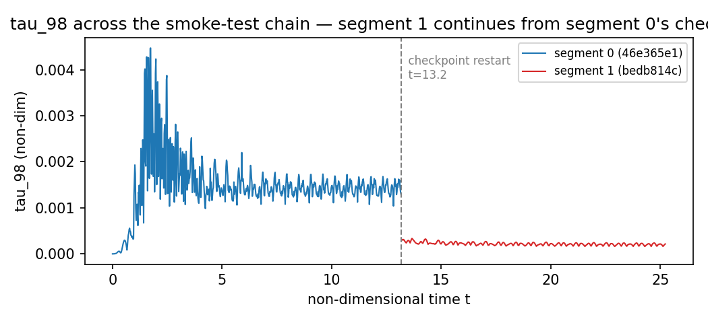

# Checkpoint restart and warm-start chains

## Two different things share the word "checkpoint"

This project uses checkpoint restart for two purposes that look identical at
the file level (a `checkpoint.dump`, restored via `argv[2]`) but mean
something different physically:

**Segment** — restarting the *same* condition purely because SLURM's
walltime cut off a single job before the simulation finished. Nothing about
the physics changes; the run is mathematically meant to continue exactly as
if it had never been interrupted. `omega_b_prev` is never set. This is what
[Your first sweep](../tutorials/first-sweep.md) and
[How to sweep one parameter](../how-to/sweep-one-parameter.md) use.

**Warm-start** — seeding a *different* condition (a different `omega_b`,
`theta_max`, etc.) from another condition's already-developed flow field,
to skip that condition's own cold-start transient. `omega_b_prev` (and the
other `*_prev` fields) are set to whatever condition actually produced the
checkpoint, and a smooth-step ramp carries the forcing from the old
condition to the new one.

Conflating these two — assuming a same-condition segment restart is
"basically free" the way it is for pure wall-clock continuation — is exactly
where this gets subtle, below.

## How the restart ramp actually works

`BioReactor.c`'s restart path:

```c
if (params.t_checkpoint > 0.0) {
    restart_file = argv[2];
    // Smooth-step interpolation starts AT the checkpoint and runs
    // N_RAMP_CYCLES forward. alpha goes 0→1 over
    // [t_checkpoint, t_checkpoint + N_RAMP_CYCLES*T_per_st].
    t_ramp_start = params.t_checkpoint;
    ...
}
```

This branch fires on **any** restart where `t_checkpoint > 0` — it has no
condition checking whether `omega_b` (or anything else) actually changed
from the segment that wrote the checkpoint. A 3-period forcing ramp is
re-triggered every single time a segment restarts, whether it's a genuine
warm-start into a new condition or just a same-condition continuation split
across two SLURM jobs for wall-time reasons alone.

For warm-starts, that's exactly the intended behavior — you *want* the
forcing to ramp smoothly from the old condition to the new one. For a
same-condition segment restart, it's an open question whether this
introduces a spurious transient that a single, uninterrupted run at the
same total duration would never see.

## Why this matters for postprocessing

`postprocess.py`'s quasi-steady-state (QSS) window is `t > t_ramp`, where
`t_ramp` is computed once from the very first ramp (`3 × T_per_nd`,
measured from `t=0`). It has no knowledge of *later* ramps that occur at
each subsequent segment boundary in a multi-segment chain — those all fall
well inside what the QSS window considers "already settled," so if a
restart-ramp transient exists, nothing currently excludes it from KPIs like
`tau_100_max` that are explicitly a *max* over the QSS window (and therefore
maximally sensitive to a brief spike, however small).



At fidelity 3 over a few rocking cycles, the same-condition restart in
[Your first sweep](../tutorials/first-sweep.md) shows no visible
discontinuity — which is what "checkpointing is basically free" would
predict. Whether that holds at production fidelity, over the many-period
durations `tau_100_max` is actually computed over, is exactly what the
isolating experiment below is checking — a clean restart at fidelity 3 over
one period doesn't rule out a small ramp transient getting captured by a
*max* statistic over a much longer QSS window.

## Resolved: a real, but partial, effect

The isolating experiment: run one condition (17.5 RPM) at a fidelity that
already has a trusted single-shot baseline (fidelity 9), deliberately split
into the same 4-segment same-condition structure a real multi-segment chain
uses, and compare against that baseline.

| Metric | Single-shot baseline | Same-fidelity, 4-segment chain | Difference |
|---|---|---|---|
| `tau_100_max` | 0.08097 | 0.07901 | **−2.4%** — within normal run-to-run noise |
| `tau_mean_max` | 0.0006463 | 0.0005360 | **−17.1%** — real, not noise |

So the restart ramp is a real contaminant, but only for `tau_mean_max` — a
spatially-averaged statistic, apparently sensitive to the ramp in a way a
2.4% difference wouldn't explain by chance. It does **not** explain the
much larger `tau_100_max` swings seen between L9 and L10 (see
[Validating against Kim et al. (2024)](kim-et-al-validation.md)) — 2.4%
can't account for a metric flipping from under-predicting Kim et al. by 15%
to over-predicting by 30%+ at the same condition. Whatever's driving that
is a genuine effect of the fidelity-9-to-10 mesh refinement, or something
else specific to L10, not checkpointing itself.
`experiments/l9_l10_checkpoint_isolation_test/` has the full manifest and
raw results.

## `n_mix_cycles` vs `n_transition_cycles`

Related but separate: fresh runs (segment 0) use `n_mix_cycles` (typically
80) rocking cycles before oxygen injection, to let the flow field develop
from rest. Restart segments use the much shorter `n_transition_cycles`
(typically 10) instead, because the flow is *already* developed — that
assumption is exactly what makes chained sweeps 70–90% cheaper than running
every condition cold. It's also exactly the assumption that same-condition
restart-ramp contamination would undermine if it turns out to be real.
