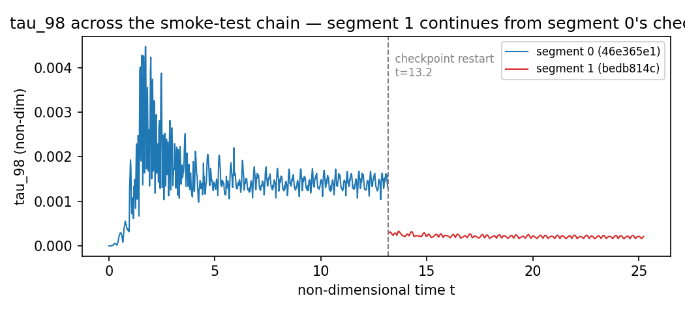

# Checkpoint restart and warm-start chains

## Two different things share the word "checkpoint"

This project uses checkpoint restart for two purposes that look identical at
the file level (a `checkpoint.dump`, restored via `argv[2]`) but mean
something different physically:

**Segment** — restarting the *same* condition purely because SLURM's
walltime cut off a single job before the simulation finished. Nothing about
the physics changes; the run is mathematically meant to continue exactly as
if it had never been interrupted. `omega_b_prev` is never set. This is what
[Your first sweep](../tutorials/first-sweep.md) and
[How to sweep one parameter](../how-to/sweep-one-parameter.md) use.

**Warm-start** — seeding a *different* condition (a different `omega_b`,
`theta_max`, etc.) from another condition's already-developed flow field,
to skip that condition's own cold-start transient. `omega_b_prev` (and the
other `*_prev` fields) are set to whatever condition actually produced the
checkpoint, and a smooth-step ramp carries the forcing from the old
condition to the new one.

Since 2026-09-16 the two cases are told apart explicitly, by
`restart_continue` in `params.json` — see
[below](#restart_continue-tells-the-two-cases-apart). Before that they were
indistinguishable to the code, which is how segments came to silently discard
their tracers.

Conflating these two — assuming a same-condition segment restart is
"basically free" the way it is for pure wall-clock continuation — is exactly
where this gets subtle, below.

## How the restart ramp actually works

`BioReactor.c`'s restart path:

```c
if (params.t_checkpoint > 0.0) {
    restart_file = argv[2];
    // Smooth-step interpolation starts AT the checkpoint and runs
    // N_RAMP_CYCLES forward. alpha goes 0→1 over
    // [t_checkpoint, t_checkpoint + N_RAMP_CYCLES*T_per_st].
    t_ramp_start = params.t_checkpoint;
    ...
}
```

This branch fires on **any** restart where `t_checkpoint > 0`. It does not
check whether `omega_b` — or anything else — actually changed from the
segment that wrote the checkpoint, so the forcing ramp is re-triggered every
time a segment restarts, warm-start or continuation alike.

For a warm-start that is the intended behaviour: you *want* the forcing to
ramp from the old condition to the new one. For a continuation there is
nothing to ramp between, and the `*_prev` fields are unset — so the ramp
interpolates up from zero forcing, briefly under-driving a segment that is
supposed to be carrying on unchanged.

Whether that matters is measured, not assumed, and the answer so far is
"barely" — see below. Removing the ramp on continuations has been tried and
made the agreement slightly *worse*, which is not understood, so nothing has
been changed on the strength of it.

## Why this matters for postprocessing

`postprocess.py`'s quasi-steady-state (QSS) window is `t > t_ramp`, where
`t_ramp` is computed once from the very first ramp (`3 × T_per_nd`,
measured from `t=0`). It has no knowledge of *later* ramps that occur at
each subsequent segment boundary in a multi-segment chain — those all fall
well inside what the QSS window considers "already settled," so if a
restart-ramp transient exists, nothing currently excludes it from KPIs like
`tau_100_max` that are explicitly a *max* over the QSS window (and therefore
maximally sensitive to a brief spike, however small).



At fidelity 3 over a few rocking cycles, the same-condition restart in
[Your first sweep](../tutorials/first-sweep.md) shows no visible
discontinuity — which is what "checkpointing is basically free" would
predict. Whether that holds at production fidelity, over the many-period
durations `tau_100_max` is actually computed over, is exactly what the
isolating experiment below is checking — a clean restart at fidelity 3 over
one period doesn't rule out a small ramp transient getting captured by a
*max* statistic over a much longer QSS window.

## Testing the hypothesis

The isolating experiment: run one condition at a fidelity that already has
a *verified-clean* single-shot baseline (fidelity 9), deliberately split
into the same same-condition segment structure a real multi-segment chain
uses, and compare against that baseline.

!!! danger "The first attempt at this used a corrupted baseline — its result doesn't count"
    17.5 RPM was the original choice, compared against L9 run `44133566` as
    the "trusted single-shot baseline." That baseline wasn't trusted enough
    — `44133566` turned out to have been overwritten by an abandoned
    cross-condition warm-start pilot (`t_checkpoint=18.85`,
    `omega_b_prev=2.356194`, seeded from 22.5 RPM), not a genuine cold
    start. The numbers from that comparison are retracted, not reported
    here. See [Validating against Kim et al. (2024)](kim-et-al-validation.md)
    for the full story of how this was found. Every condition used anywhere
    else on this site was individually re-verified (`t_checkpoint=None`,
    raw data starting at `t=0`) specifically because this happened —
    reusing an existing "baseline" without checking its actual params.json
    first is exactly the mistake to avoid.

## Resolved: not a real effect

Redone on a condition whose baseline was verified clean *before* use this
time: `t_checkpoint=None`, `omega_b_prev=None`, `shear_stress.dat` starting
at `t=0`.

Both `tau_100_max` and `tau_mean_max` came out a few percent below the clean
single-shot baseline — nowhere near the much larger gap the retracted
(corrupted-baseline) experiment showed. That result was almost certainly an
artifact of comparing against a cross-condition warm-started run, not
evidence of restart contamination. On a valid comparison, **same-condition
checkpoint restart segmenting does not meaningfully perturb either metric**;
the differences are consistent with ordinary run-to-run restart numerics.

That rules checkpointing out as the explanation for the L9-vs-L10
`tau_100_max` sign flip (see [Validating against Kim et al. (2024)](kim-et-al-validation.md)).
`experiments/l9_l10_checkpoint_isolation_test_30rpm/` has the manifest and
the raw numbers.

A follow-up, cheaper experiment (`experiments/l9_l10_short_window_test_30rpm/`)
then tested the mesh-fidelity change directly: two cold-start runs at the
same condition, one at fidelity 9 and one at fidelity 10, each truncated to
a single short window just past the ramp (t=[6.0, 8.5], no chaining, no
checkpoint restart of any kind). `tau_100_max` more than doubled between fidelity 9 and fidelity 10 in that
short window alone. That is real, direct evidence — not an untested guess — that the mesh-fidelity
change itself is a fast, resolution-intrinsic driver of the sign flip; see
[Validating against Kim et al. (2024)](kim-et-al-validation.md#the-part-that-smells)
for the full numbers.

## Segments used to throw away the tracer and the oxygen

Everything above is about momentum. The scalars were a different story.

Until 2026-09-16, the restart path ran `reset (stracers, 0.)` — zeroing `c`,
`oxy`, `c1`, `c2` and `c3` — on **every** restart, segment or warm-start
alike. For a warm-start that is right: the new condition wants its own tracer
experiment. For a segment it is fatal, because the whole point of a segment is
that nothing physical changes. Any chained mixing or kLa run measured from a
blank field.

It hid for so long because `write_restart_diagnostic` tracked `u`, `p`, `f`,
`pf` and `g` — the fields a 2026-09-07 investigation had suspected — and all
of them round-trip to full double precision. The restart looked immaculate.
Nobody was watching the fields the experiment actually depended on.

The line is not careless, and its stated reason is real: stale *coarse-level*
ghost values from the checkpoint drive a gradual multigrid divergence. But the comment on it names `restriction()` as the cure,
and `restriction()` recomputes coarse cells *from the leaves*. The leaves were
never the problem — and on a segment they are the entire experiment. The
zeroing overshot its own diagnosis.

!!! note "The two obvious culprits were both wrong"
    The bisection is worth recording, because the first two hypotheses were
    confident and both survived long enough to nearly get patched. `restore()`
    looked guilty — it is called with `list=NULL`, so `restore_all` is false
    and any field name that doesn't match routes to a discarded placeholder,
    exactly the documented `p`/`pf` trap. It was innocent: `c2` comes back
    bit-exact. Then `solid()`, which does run on every restart. Also innocent.
    The fields survive both and die between `post_solid` and the end of
    `event init`. Reading the dump's own field table (`scripts/dump_fields.py`)
    settles the first question in one command — `c`, `oxy`, `c1`, `c2`, `c3`
    are all written.

## `restart_continue` tells the two cases apart

The fix is one parameter, defaulting to the old behaviour so sweeps are
untouched:

| `restart_continue` | meaning | tracers | `event tracer` |
|---|---|---|---|
| `0` (default) | **warm-start** — a new condition, a new tracer experiment | zeroed | re-injects after `n_mix_cycles` |
| `1` | **segment** — one experiment across a walltime boundary | preserved | does not fire |

`restriction()` still runs in both cases, so the coarse-ghost problem the
original `reset` was aimed at stays fixed.

The tracer event is guarded with an `if` wrapper rather than an early
`return` — a valueless `return` in a Basilisk event compiles to a *nonzero*
int return, which silently stops the time loop.

!!! warning "Staging a dump is not the same as arming a restart"
    The restart branch is gated on `params.t_checkpoint > 0`, **not** on
    `argv[2]` being present. `simulate.submit_slurm`'s `checkpoint=` argument
    only copies the file into place. A submit script that stages a dump and
    forgets `t_checkpoint` gets a silent **cold start** — no error, no
    warning, and a `results.json` that looks perfectly ordinary.
    `runs/kimcheck_l10_rpm32.5` was described as warm-started and was not.
    The tell is `restart_diagnostic_post_restore.txt`: present means the
    branch actually ran.

## Chained segments are stitched automatically

The physics carries across cleanly. A split run and an unbroken run of the
same total duration agree on kLa at every threshold, and C\* is continuous
across the seam — `tests/verification/test_restart_continue.py` pins both.

The trap is on the postprocessing side. `postprocess.py` computes kLa per
**run directory**, and a later segment restores an already-saturated oxygen
field — so C\* starts near 1 and crosses every threshold at its first row.
A later segment alone returns the *same* kLa at every threshold — precisely
the degenerate signature `test_kla_values_differ_across_saturation_levels`
was written to catch.

So `postprocess.py` does not compute from one directory. It walks
`_parent_run` backwards to the root of the chain and concatenates the raw
series first, dropping the duplicated sample each seam reports. Every KPI
that integrates over the experiment — kLa and the mixing times — is computed
from the joined series, so a chained run scores the same as an unbroken one
and no caller has to remember anything.

A run with no `_parent_run` is its own chain, so nothing changes for
unchained runs. Continuations set it; a warm-start does not, because it
begins a *different* experiment and must not be joined to its seed.

`tests/verification/test_restart_continue.py` guards all of this: seam
continuity, stitched-vs-continuous kLa, and the degenerate per-segment case.

!!! note "One residual gap, still unexplained"
    Over a *short* segment the agreement is not exact — oxygen transfer comes
    out slightly below an unbroken run. Two mechanisms were hypothesised and
    both were falsified by measurement: replenishment pausing (firing
    `event oxygen` immediately changes nothing) and the smooth-step ramp
    (removing it made things *worse*). An under-driving ramp whose removal
    reduces oxygen transfer is not understood, so no change was shipped on
    the strength of it. Over longer segments the effect disappears, so it
    reads as a short-segment transient rather than a persistent bias — but it
    is genuinely open.

## `n_mix_cycles` vs `n_transition_cycles`

Related but separate: fresh runs (segment 0) use `n_mix_cycles` (typically
80) rocking cycles before oxygen injection, to let the flow field develop
from rest. Restart segments use the much shorter `n_transition_cycles`
(typically 10) instead, because the flow is *already* developed — that
assumption is exactly what makes chained sweeps 70–90% cheaper than running
every condition cold. It's also exactly the assumption that same-condition
restart-ramp contamination would undermine if it turns out to be real.

Both numbers only apply to a **warm-start**. Under `restart_continue=1` the
tracer is never re-injected at all, so neither count is consulted — the
experiment simply carries on.
