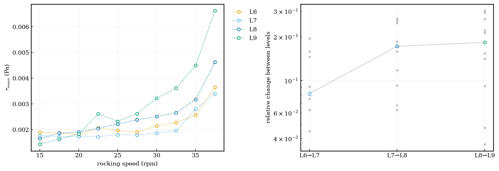
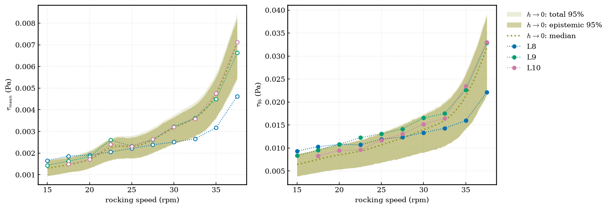
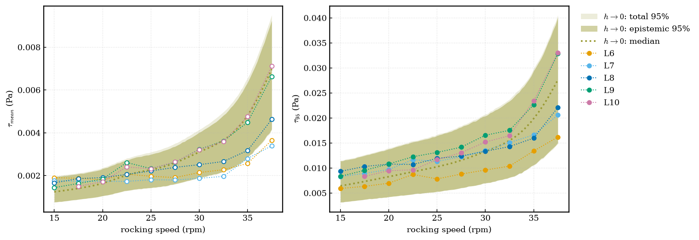
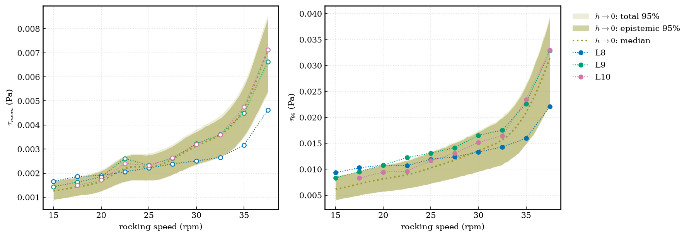
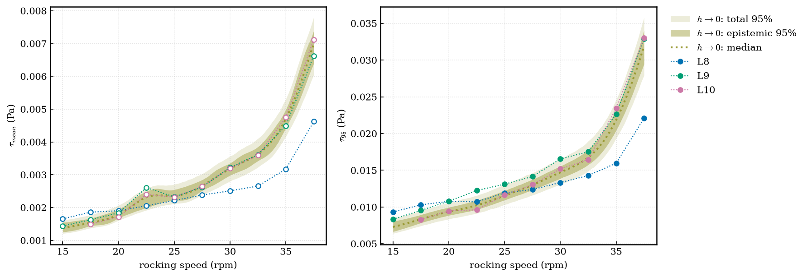
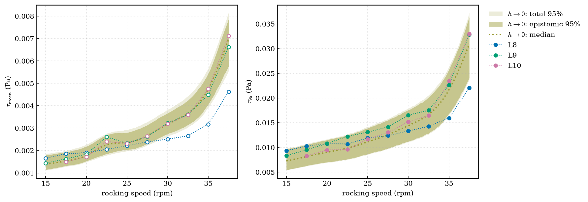
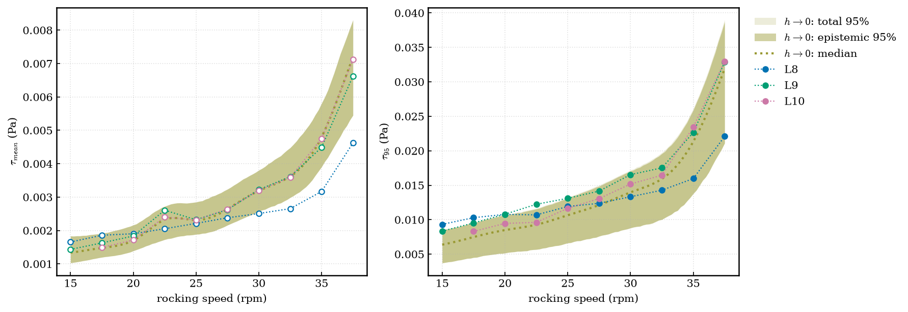
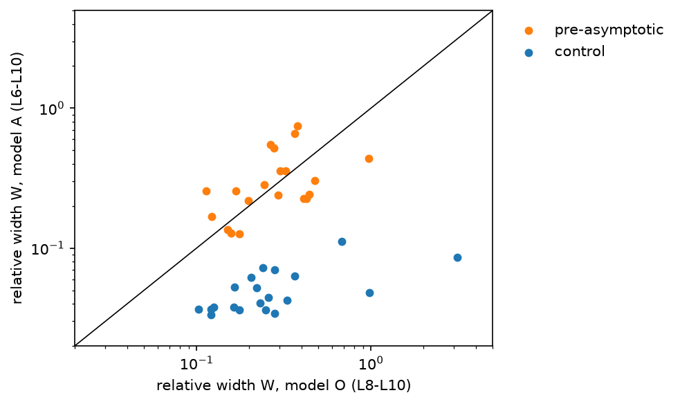
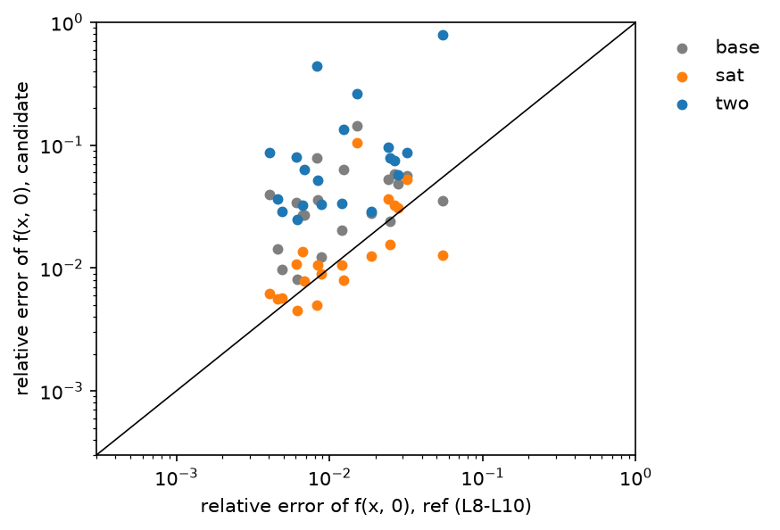
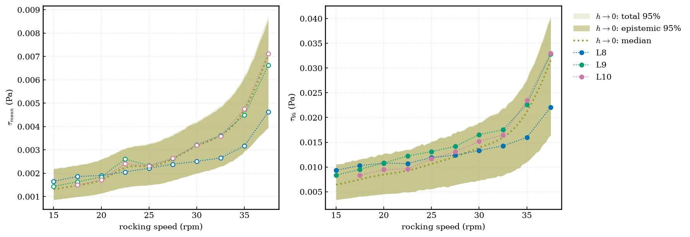

# Grid convergence of the shear stress with gcbml

This page shows how well the mean and the 95th-percentile shear stress converge with the grid level, and what the
`gcbml` package predicts at zero cell size (h → 0). The data are at theta = 7 deg, rocking speed 15 to 37.5 rpm.
Every value is computed over the same window: the last 3 whole rocking cycles before the tracer release.

**Reading the figures.**

- Colour shows the grid level (L6 orange, L7 sky blue, L8 blue, L9 green, L10 pink). Dotted lines are our data.
- A hollow marker is a time mean (τ_mean). A filled marker is a tail statistic (τ95).
- The olive line is the median prediction at h → 0. The dark olive band is the epistemic 95% interval.
  The light olive band is the total 95% interval (epistemic uncertainty plus run-to-run noise).

## 1. The data do not converge from L6 to L9

The median relative change between successive levels is 8% (L6 to L7), 17% (L7 to L8) and 18% (L8 to L9).
The changes grow instead of falling. From L9 to L10 the change is smaller (0.4% to 9%). L6 and L7 are not in the
asymptotic range of the scheme.

## 2. Prediction at h → 0

The model assumes that the grid error follows one power law, h^p, with order p between 0.5 and 2.9 (95% prior
range: the formal order of the scheme is 1 to 2).

With L8, L9 and L10, the relative epistemic uncertainty at h → 0 is 6.5% for τ_mean and 10.6% for τ95
(median over rpm, one standard deviation).

When L6 and L7 are added, the uncertainty is 14.5% for τ_mean and 21% for τ95, and the fitted order drops from 1.4
to 0.6.

## 3. What sets the width of the band

With three levels the data cannot identify the order p. The posterior of p (0.6 / 1.4 / 2.6) is close to its prior
(0.5 / 1.2 / 2.9).

| Change to the fit | τ_mean | τ95 |
|---|---|---|
| Baseline | 6.5% | 10.6% |
| p fixed at 1.0 | 9.2% | 12.0% |
| p fixed at 1.5 | 5.3% | 6.0% |
| p fixed at 2.0 | 4.0% | 3.9% |
| p fixed at 3.0 | 3.6% | 2.9% |
| Error-amplitude priors 5 times tighter | 6.0% | 8.7% |
| Run-noise prior 20 times tighter | 6.5% | 10.5% |

The band follows p. It does not follow the amplitude priors or the noise prior.

## 4. Synthetic test: levels outside the asymptotic range

We built a synthetic generator in which the coarse levels are saturated (their error is nearly constant), and
calibrated it to the level-to-level changes above (8%, 17%, 18%, 6%). The test criteria were fixed before the first
run.

Round 1 (current model): the coverage of the 95% interval was 92%, so the model stays calibrated. But the point
error of the h → 0 value was 4.7% with all levels, against 1.4% with L8 to L10 only. The fitted order was 0.75
(true: 1.24). The coarse levels bias the answer, and the model hides it with a wider interval.

Round 2 tested two changes of the error shape on new truths. The saturating shape adds one hyperparameter (h_s,
the size of the asymptotic range). The two-term shape (two powers of h) adds two. On 40 pooled truths:

| Model | Coverage (needs 0.90 or more) | Width against L8 to L10 (needs 1.25 or less) | Error against L8 to L10 (needs 1.5 or less) |
|---|---|---|---|
| Current model, all levels | 0.897 (fails) | 1.02 | 3.02 (fails) |
| Saturating shape, h_s at least h_min | 0.939 | 0.58 | 1.05 |

The two-term shape failed the round-2 criteria (width 3.2 and error 5.4 times the reference, slow fits).
Note: the error criterion was added after we saw round 1. All later candidates ran on seeds the baseline had not seen.

## 5. On the real data the saturating shape gives no gain

On the real τ_mean data the uncertainty is 8.6% (L8 to L10) and 19.7% (L6 to L10), not smaller than the current
model. The size of the asymptotic range, h_s, is not identified. In a hold-out test (fit L6 to L9, predict the
observed L10 at 9 rpm), both models have a median error of about 8% to 9% for τ_mean and 14% to 18% for τ95, and both
cover 8 or 9 of 9 points. The real data are non-monotone in rpm, and the transition level probably depends on rpm.

!!! note "Open points"
    - The L10 values come from chained runs (3 cycles after an rpm change), except at 32.5 rpm.
    - The set of levels used in the fit was chosen by hand. The automatic test for this (gate G4) does not detect
      pre-asymptotic levels.
    - The package is at <https://github.com/elvis-aguero/gcbml>.
