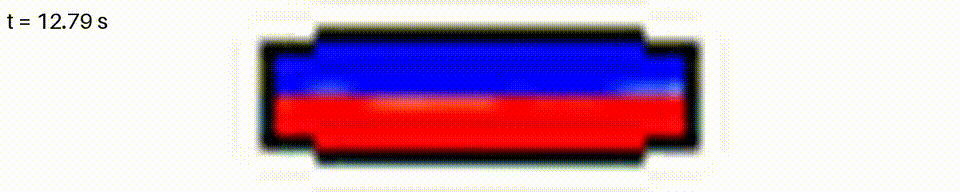

# Your first simulation

This walks through running one simulation from a cold start to a finished
`results.json`, using the real binary at fidelity 3 (fast enough to run on a
login node in under a minute). Every command and output below was actually
run to write this page — you should see the same shape of output, though
your exact CPU-time numbers will differ.

## 1. Build

```bash
uv sync
make build
```

`make build` compiles `build/BioReactor` from `src/BioReactor.c` via
Basilisk's `qcc`. If this is your first build, see [Setup](../setup.md) —
you need Basilisk's `qcc` on your `PATH` first.

## 2. Write a params.json

Fidelity 3 (8×8 cells) is too coarse to trust physically, but that's the
point of this tutorial — it's about the *pipeline*, not the physics. We'll
also cut `n_mix_cycles` down to 5 (from a normal 80) so oxygen injection
starts almost immediately, and `t_end` down to 40, so the whole run finishes
in seconds instead of minutes.

```bash
mkdir -p runs/tutorial_demo
cat > runs/tutorial_demo/params.json <<'EOF'
{
  "run_id": "tutorial_demo",
  "fidelity": 3,
  "omega_b": 3.93,
  "n_harmonics": 1,
  "theta_max": [7.0, 0.0, 0.0],
  "phi_angular": [0.0, 0.0, 0.0],
  "omega_h": 0.0,
  "amplitude_h": [0.0, 0.0, 0.0],
  "phi_horizontal": [0.0, 0.0, 0.0],
  "geometry": {"a": 0.25, "b": 0.03575, "n": 8.0},
  "fill_level": 0.5,
  "n_mix_cycles": 5,
  "t_end": 40.0
}
EOF
```

## 3. Run it

```bash
cd runs/tutorial_demo
../../build/BioReactor params.json
```

Expected tail of output:

```
checkpoint: writing checkpoint.dump at t=40.13

# Quadtree, 7217 steps, 12.7809 CPU, 14.1 real, 3.28e+04 points.step/s, 85 var
```

`14.1 real` is wall-clock seconds. You should now have six files sitting
next to `params.json`:

```
checkpoint.dump  logstats.dat  normf.dat  shear_stress.dat  tr_oxy.dat  vol_frac_interf.dat
```

See the [output files reference](../reference/output-files.md) for what each one contains.

## 4. Postprocess

```bash
cd ../..
uv run python scripts/postprocess.py runs/tutorial_demo/
```

This writes `runs/tutorial_demo/results.json`. Ours came out to (re-verified
2026-08-28 against the current binary -- 23 keys, not 19; four
`tau_*_strict`/`_signed`/`ediss_mean_qss` keys were added 2026-08-07/08):

```json
{
  "kLa_10": 18468.49, "kLa_25": 22405.20, "kLa_50": 17993.96,
  "kLa_inst_10": 20324.58, "kLa_inst_25": 25167.45, "kLa_inst_50": 26011.25,
  "dtmix_0.50": 0.158, "dtmix_0.75": 0.158, "dtmix_0.95": 0.263,
  "vor_mean": 5.118, "vel_rms_qss": 1.310, "kla_fit_rmse_25": 0.0493,
  "tau_95_qss": 0.00565, "tau_98_qss": 0.00613, "tau_100_qss": 0.00800,
  "tau_95_max": 0.00750, "tau_98_max": 0.00885, "tau_100_max": 0.01194,
  "tau_mean_max": 0.00226,
  "tau_100_max_strict": 0.01194, "tau_mean_max_strict": 0.00278,
  "tau_100_max_signed": 0.01194, "ediss_mean_qss": 0.0331
}
```

## 5. See it

Fidelity 3 is too coarse to look at — 8×8 cells barely resolves the
interface. Bumping to fidelity 5 (32×32) and using `BioReactor-video`
instead makes the sloshing actually visible, at the cost of ~1 minute
instead of ~15 seconds:

```bash
make build-video
mkdir -p runs/tutorial_video_demo
cat > runs/tutorial_video_demo/params.json <<'EOF'
{
  "run_id": "tutorial_video_demo",
  "fidelity": 5,
  "omega_b": 3.93,
  "n_harmonics": 1,
  "theta_max": [7.0, 0.0, 0.0],
  "phi_angular": [0.0, 0.0, 0.0],
  "omega_h": 0.0,
  "amplitude_h": [0.0, 0.0, 0.0],
  "phi_horizontal": [0.0, 0.0, 0.0],
  "geometry": {"a": 0.25, "b": 0.03575, "n": 8.0},
  "fill_level": 0.5,
  "n_mix_cycles": 8,
  "t_end": 20.0
}
EOF
build/BioReactor-video runs/tutorial_video_demo/params.json
uv run python scripts/render_videos.py runs/tutorial_video_demo
```

`BioReactor-video` itself only dumps raw binary frames to
`runs/tutorial_video_demo/frames/` — `render_videos.py` is the separate step
that actually renders and encodes them (needs `ffmpeg` on `PATH`; `module
load ffmpeg` on OSCAR), producing `volume_fraction.mp4` (body frame, rocking
with the bag) and `volume_fraction_lab.mp4` (lab frame, fixed camera):



This is the same VOF field that `vol_frac_interf.dat` records numerically —
the video is just that field rendered frame by frame, nothing the solver
computes differently.

!!! note "There's a second, separate video pipeline"
    `config/slurm_video_template.sh` + `scripts/submit_video_run.py` render
    videos a different way — directly from Basilisk's own view/`bview`
    output via `ppm2mp4`, producing `vorticity3.mp4`/`oxygen3.mp4`/`tracer*.mp4`
    instead of `volume_fraction*.mp4`. That path hasn't been exercised while
    writing this page; the steps above are the ones actually verified here.

## What you just exercised

`BioReactor` read `params.json`, ran the two-phase VOF solver with Henry's-law
oxygen transport, wrote its state to `.dat` files as it went, dumped a
`checkpoint.dump` at the end (this matters once you get to
[checkpoint restart](../explanation/checkpoint-restart.md)), and
`postprocess.py` reduced those raw files down to the KPIs in
`results.json`. Every other workflow in this project — sweeps, batch
sampling, the BO loop — is this same run → postprocess step, automated and
repeated.

## Next

- [Your first sweep](first-sweep.md) — chain several of these together with checkpoint restart
- [Your first optimization loop](first-optimization-loop.md) — no Basilisk build required
